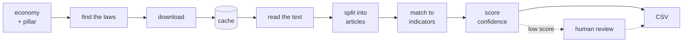

# VeriTrade — AI Tool for Digital Trade Regulatory Analysis

Autonomous discovery and article-level mapping of digital-trade law across twelve Asia-Pacific
economies. Submission for the UN ESCAP / KMITL Global Hackathon on AI for Digital Trade
Regulatory Analysis, 2026 — **Final round**.

- **Hosted instance:** https://veritrade.ftu.fyi — full interface, keys in platform secrets, no setup
- **Source:** https://github.com/ftulabs/law-v2.0
- **Team:** FTU (Foreign Trade University, Viet Nam) · minhtc@ftu.edu.vn

---

## Technical memo

**The question.** *Given an economy and a regulatory pillar, which provisions of which laws
satisfy which RDTII indicators — and where exactly are they?* By hand that means reading a
national statute book in its own language and citing to the paragraph.



Three things in that line are the whole design.

| | |
| :--- | :--- |
| **"find the laws"** | takes only the economy and the pillar. No seed URL, no law name. |
| **cache** | everything left of it uses the network; nothing right of it does. So a second run costs nothing and fetches nothing. |
| **"match to indicators"** | the model sees the indicator's legal test *and every sibling indicator*, so it must choose, not merely agree. |

**Every engine choice carries a reason.** Each economy resolves to a named OCR engine,
reranker and model, each tagged `measured` / `documented` / `assumed`, so a preference nobody
can justify is one we do not ship. `python -m backend.providers.engine_profile` prints it. The
registry says what an engine *supports*; the factory checks what is *installed* and substitutes
rather than running a recogniser whose dictionary cannot spell the script — which yields fluent
text with letters missing and raises nothing.

**Language and script are different questions.** Script decides how text is tokenised; language
decides whether the English reranker runs at all. Viet Nam and Indonesia use Latin letters and
still need the non-English lane.

**The quote is never rewritten.** The Verbatim Snippet column *is* the statute's own text —
carried unchanged from extraction to CSV, and substring-verified against the stored source. The
grading prompt is English and demands English *output*, but passes the snippet through
untouched: a translated citation is a false citation.

**Cost.** OCR, embedding and retrieval run locally at $0. Only the grading model and the
optional search API cost anything — **~$0.012 per document**, or **$0.00** on the open-weights
swap. See [Measured Cost](#measured-cost).

---

## Quick Start

**Target: a working system on a clean machine in under 30 minutes, from this section alone.**

```bash
git clone https://github.com/ftulabs/law-v2.0.git && cd law-v2.0

python -m venv venv && source venv/bin/activate     # Windows: venv\Scripts\activate
pip install -r requirements.txt                     # Python 3.10–3.12; ~2 GB, several minutes

cp .env.example .env                                # runs with NO key at all — see below
streamlit run frontend/app.py                       # → http://localhost:8501
```

**Verify.** In the interface pick **Singapore**, topic **Cross-border data policies**, press
**Run analysis**. Expected on the bundled sample: a populated coverage matrix in **under 2
minutes**, written to `outputs/`. A live run takes **6–9 minutes** per economy-pillar, most of
it embedding on CPU.

**Everything else happens in the interface** — starting a run, reviewing, correcting, switching
engines, exporting. You should not need the command line again. `AUTH_ENABLED=false` skips the
sign-in screen for a demo.

**Keys are optional.** With none set, the tool runs the offline sample corpus through a
deterministic mock grader at $0, which is enough to reach the verify step. For real mapping:

```env
LLM_PROVIDER=openrouter        # or anthropic · openai · gemini · local · mock
OPENROUTER_API_KEY=sk-or-...
OCR_PROVIDER=rapidocr          # or paddle · tesseract · azure · vlm · mock
SERPER_API_KEY=...             # optional; discovery falls back to free search
```

`.env` is gitignored; no key is committed. The first run is slow while the sentence-transformer
model loads, then cached. A `402` from OpenRouter means the key has no balance — set
`LLM_PROVIDER=mock` to confirm the rest of the pipeline works.

<details>
<summary>Command line, if you prefer it</summary>

```bash
python main.py --economy Singapore --pillar 6                  # offline sample, no key, no network
python main.py --economy Singapore --pillar 6 --live           # live crawl
python main.py --economy Singapore --pillar 6 --live --fresh   # ignore caches, re-crawl
python batch_run.py --economies Singapore Australia Malaysia --pillar 6 7 --live
```
</details>

---

## Your Interface

Criteria **C3a** and **C3b** are marked on the interface by someone who did not build it.

| What a reviewer needs to do | Where it is |
| :--- | :--- |
| Start a run and watch progress in plain words | Sidebar → *Country* → *Topic* → **Run analysis**. Five named stages, not a log |
| Open the audit view: a result beside the source text | Tab **Details** → *Pick a result to inspect* — legal test, verbatim quote, surrounding source, then confidence |
| Follow a row to its official source at the cited article | Tab **Results** → click a matrix cell → **Source URL** |
| Accept, reject or correct a row | Tab **Needs review** (the tab label carries the queue count) |
| Switch the AI engine | Tab **Engines**, on the main screen. No file edited, no command typed |
| Export to the RDTII schema | Tab **Download** → Submission CSV · Evidence JSON · Scored CSV |

**Walkthrough recording:** *to be recorded before 30 September, submitted with the Word document.*

---

## Your Two Declared Engines

Required by **C4b** (No Vendor Lock-in), tested again live as **C5b**. Declared in Section 5 of
the Word submission on 30 September and **cannot change afterwards**.

|  | Engine A — commercial hosted | Engine B — open weights |
| :--- | :--- | :--- |
| Provider and model | *pending bake-off* | *pending bake-off* |
| Config value | `LLM_PROVIDER=openrouter` | `LLM_PROVIDER=local` |

> The declaration freezes on 30 September and cannot be revised, so we are not naming two
> engines before measuring them. The bake-off scores each candidate against
> `data/ground_truth/rdtii_reference_p67.csv` — 180 rows from the panel's own 2025 databases
> across six economies.

**Switching:** interface → tab **Engines** → select. A steward watches this on 15 October; a
switch needing code or config scores zero.

**Re-running without fetching:** leave *Fresh crawl* off (the default). Downloaded documents
live in `cache/`, named by content hash, indexed in `cache/_index.json`. The second pass fetches
nothing and its document list is empty. Delete the directory to force a cold run.

Adding a provider means one class with `complete_json(system, user)` registered in
`backend/providers/llm_factory.py` → [docs/ARCHITECTURE.md](docs/ARCHITECTURE.md)

---

## Swapping the OCR Engine

Set `OCR_PROVIDER` in `.env`, or pick it in the **Engines** tab. No code changes.

| Engine | Config value | Proprietary? | Notes |
| :--- | :--- | :--- | :--- |
| RapidOCR | `rapidocr` | no | Default. ONNX, pip-only. **CER 1.11 %** measured on the bundled scan |
| PaddleOCR | `paddle` | no | PP-OCRv5 per-script models — the Thai and East-Slavic recognisers |
| Tesseract | `tesseract` | no | Needs a system binary; the only offline option for Lao |
| Vision model | `vlm` | optional | Reads any script. Point at a local Ollama for open weights |
| Azure Document Intelligence | `azure` | **yes** | Strongest on noisy gazette scans; needs endpoint + key |
| Mock | `mock` | no | Offline sidecar, $0 |

**The core pipeline runs with no proprietary API.** Azure is the only proprietary option and is
never a default; the vision engine satisfies the same declaration when pointed at a locally
served open-weights model.

→ per-language evidence, and why Paddle is disqualified for Vietnamese, Mongolian and Kazakh:
[docs/OCR_LANGUAGE_EVIDENCE.md](docs/OCR_LANGUAGE_EVIDENCE.md)

---

## Crawling Politely

Built in and **on by default** — a ministry running this tool should not have to configure it,
and on 15 October five tools read the same government sites within the same hour.

| Setting | Value | Where it is set |
| :--- | :--- | :--- |
| Max requests per second per host | 0.5 (a 2-second gap) | [`config.py:124`](backend/config.py#L124) `crawl_delay_seconds` |
| Parallel requests per host | 1 | [`fetch.py:62`](backend/pipeline/fetch.py#L62) `_polite_wait` |
| robots.txt respected | yes | [`robots.py`](backend/pipeline/robots.py), enforced at [`fetch.py:140`](backend/pipeline/fetch.py#L140) |

A host's own `Crawl-delay` wins when larger than ours; an unreadable robots.txt denies; a
skipped document is logged by URL and reason, never silently dropped.

→ per-portal robots findings, and why user-agent matching has to be exact:
[docs/CRAWLING.md](docs/CRAWLING.md)

---

## Supported Economies and Portals

Generated from the registries the pipeline reads — `python tools/readiness.py` — so it cannot
claim a capability the code does not have.

**declared** = resolves, language profile, OCR engine · **reachable** = a portal answered ·
**extracted** = provisions produced · **measured** = scored against the panel's 2025 database.
Only *measured* is a claim about quality.

| Economy | Live-test nine | Language | Portal | Run end to end? | Next blocker |
| :--- | :---: | :--- | :--- | :--- | :--- |
| Thailand | yes | Thai | krisdika.go.th (+1) | declared | TLS fixed; document path unknown |
| Viet Nam | yes | Vietnamese | vbpl.vn | reachable | no discovery adapter yet |
| Indonesia | yes | Indonesian | peraturan.bpk.go.id (+1) | reachable | no discovery adapter yet |
| China | yes | Chinese | gov.cn (+1) | **extracted** | not yet scored against the 2025 database |
| India | yes | English | indiacode.nic.in (+1) | declared | portal is a JS shell |
| Kazakhstan | yes | Kazakh | adilet.zan.kz | reachable | robots closes the listing paths |
| Lao PDR | yes | Lao | laoofficialgazette.gov.la | declared | host does not resolve |
| Mongolia | yes | Mongolian | legalinfo.mn | reachable | no discovery adapter yet |
| Russian Federation | yes | Russian | publication.pravo.gov.ru | reachable | robots disallows `/File`; use the sitemap |
| Singapore | — | English | sso.agc.gov.sg | **measured** | — |
| Australia | — | English | legislation.gov.au (+1) | **measured** | — |
| Malaysia | — | English | lom.agc.gov.my (+2) | **measured** | — |

**Of the nine live-test economies today: 0 measured, 1 extracted, 5 reachable, 3 declared.**
Singapore, Australia and Malaysia are our deepest corpora but are *not* among the nine — the
panel holds no 2025 database for them.

Mongolia's statutes are served as HTML, not scanned PDF (measured: 12.4k Cyrillic characters in
the response body, zero PDF links), so OCR is not on its critical path.

---

## Output Format

Fourteen columns, this exact order: the thirteen from Round 1 unchanged, plus **Language of
Source**. Source of truth is `SUBMISSION_COLUMNS` in `backend/schemas.py`.

| # | Column | Req. | Notes |
| :--- | :--- | :--- | :--- |
| 1 | Economy | ✓ | Official UN name — "Viet Nam", "Lao People's Democratic Republic" |
| 2 | Law Name | ✓ | Full official name and year |
| 3 | Law Number / Ref | | `Act 709`, `B.E. 2562` |
| 4 | Last Amended | | Month + year when verified; `Original` when the portal shows none |
| 5 | Indicator ID | ✓ | **RDTII 2.1 code as text: `6.1`, `7.3`, `12.9`. Never `P6-I1`** |
| 6 | Article / Section | ✓ | `s. 26(1)`, `Art. 26(2)` — the section, not just the act |
| 7 | Discovery Tag | ✓ | NEW / KNOWN, decided **per provision** |
| 8 | Location Reference | | PDF page, or HTML anchor |
| 9 | Verbatim Snippet | ✓ | Exact text — no editing, paraphrase or translation |
| 10 | Mapping Rationale | | ≤ 300 chars, naming the legal mechanism |
| 11 | Source URL | ✓ | Direct URL on the official portal |
| 12 | Confidence | | 0.00–1.00 |
| 13 | Notes | | OCR issues, bilingual sources, instrument warnings |
| 14 | Language of Source | ✓ | The document's original language, not the one we read it in |

Three rules that cost rows if broken:

- **IDs are text.** Entered as a number, `12.10` collapses to `12.1` and `4.01` to `4.1` — four
  different indicators. `backend/rdtii/codes.py` converts and checks against the 61 in-scope codes.
- **Column 15, "Pillar (auto)", is deliberately not written.** The workbook holds a formula
  there and the Coverage Matrix reads it; a literal would silently empty every coverage count.
- **Discovery Tag is per provision, not per law.** If the panel cites PDPA s.26 and we
  independently surface s.11(3), a law-level match would report our own find as something we
  were handed. `backend/rdtii/baseline.py` matches law *and* article, reducing `第四十条`,
  `14 дүгээр зүйл`, `s. 26(1)` and `APP 8` to a common numeric spine.

Indicators with no evidence get an explicit **"No provision found"** row, never a blank. The
JSON adds `ocr_quality.cer`, `pdf_is_scanned`, `retrieval_log`, the confidence breakdown,
surrounding source context, and `model_version`.

---

## Measured Cost

**Measured 2026-07-12** · one ~50-page Act, ~64 grading calls · `deepseek/deepseek-v4-flash` at
$0.09 / $0.18 per 1M input / output tokens (OpenRouter, verified) · Serper at $1.00 / 1k queries.

| Component | Engine used | Measured cost |
| :--- | :--- | :--- |
| OCR | RapidOCR (local) | $0.000 |
| Embedding | MiniLM + BM25 (local) | $0.000 |
| Mapping — Engine A | *pending declaration* | — |
| Mapping — Engine B | *pending declaration* | — |
| Mapping — current default | deepseek-v4-flash | **$0.012 / document** |
| Crawling | Serper (optional) | **$0.19** per 3-economy run; the free tier covers it |
| **Total, current stack** | | **~$0.012 / document** + crawling |
| **Total, open-weights swap** | Ollama + RapidOCR + free search | **$0.00 / document** |

**Wall-clock:** 6–9 minutes per economy-pillar on a live run, CPU only.

> **Not yet automatic.** The template requires cost recorded per run and per engine "without
> manual arithmetic". Every unit is measurable — token counts come back in each API response,
> OCR and embedding are local and free — but the meter that threads through the pipeline and
> sums them per run does not exist yet. It is built before 30 September, and the figures
> re-measured with the declared engines. Reproduce the current numbers:
> `python tools/cost_logger.py --pdf data/samples/AU/privacy_act.pdf --economy Australia --pillar 6`

---

## Known Limitations

A tool that flags what it could not read is better built than one that presents everything with
equal confidence.

- **Six of the nine live-test economies have no discovery adapter.** Their portals answer and
  their language handling is in place, but nothing yet enumerates what laws exist on them.
- **Confidence is relative, not a calibrated probability.** Below 0.85 a human should look;
  below 0.60 the row is quarantined and excluded from the submission by default.
- **Confidence is not comparable across language lanes.** Its retrieval component sits on a
  different scale in each (measured: 0.303 with the cross-encoder against 0.514 without), so two
  equally good rows from two economies carry different numbers. The fix — ranking within the
  shortlist rather than the raw score — is not applied because it moves every existing row.
- **The multilingual reranker is off by default.** 568M parameters against 23M, an order of
  magnitude slower; enabled, it turned one China pillar into an 11-hour run. Turning it off
  *raises* retrieval scores and changed 0 of 20 shortlist rows.
  Set `CROSS_ENCODER_MULTILINGUAL_ENABLED=true` if you have a GPU.
- **OCR accuracy is validated only for Latin script** (CER 1.11 %). No document-level CER exists
  for Thai, Lao, Mongolian or Kazakh from any engine, ours included.
- **The vision OCR engine can hallucinate.** Classical OCR degrades into visible noise; a vision
  model degrades into a fluent sentence that was never in the document. It is the last engine
  tried, runs at temperature 0, writes `[illegible]` rather than guessing, and returns no
  confidence — we report `None` rather than inventing one.
- **The offline mock grader is lexical** and can confuse 6.1 with 6.4, or 7.1 with 7.2. Use a
  real LLM for anything submitted.
- **Live crawling depends on portal availability**; the bundled sample corpus is the fallback.

---

## Docs

| Doc | What it covers |
| :--- | :--- |
| [docs/ARCHITECTURE.md](docs/ARCHITECTURE.md) | **System design.** Part I orients a new contributor with diagrams; Part II is the reference — schemas, formulas, and why the confidence weights are what they are |
| [docs/CRAWLING.md](docs/CRAWLING.md) | **Politeness and robots.txt** — per-portal findings, and why user-agent matching has to be exact |
| [docs/OCR_LANGUAGE_EVIDENCE.md](docs/OCR_LANGUAGE_EVIDENCE.md) | Per-language OCR evidence: what was measured, what is only documented, what is a gap |
| [docs/retrieval-redesign.md](docs/retrieval-redesign.md) | How the retrieval parameters were swept, and two counter-intuitive results not to re-litigate |
| [docs/round2-expansion.md](docs/round2-expansion.md) | Multilingual expansion — tokenisation, article boundaries, the grading prompt for non-English text |
| [docs/AUTH_AND_DATABASE.md](docs/AUTH_AND_DATABASE.md) | Accounts, sessions, and the one env var that moves storage to cloud Postgres |
| [docs/NOTES_FOR_JUDGES.md](docs/NOTES_FOR_JUDGES.md) | Decisions a reviewer may want the reasoning for |
| [docs/precompute-corpus.md](docs/precompute-corpus.md) | The precomputed corpus layers (L0–L3), currently paused |

---

## Repo layout

```
backend/
  pipeline/     discovery · robots · fetch · ocr · extraction · retrieval · mapping · orchestrator
  providers/    LLM and OCR factories, per-economy engine profile, language registry
  rdtii/        indicator legal tests · 12-pillar reference · scoring · codes · baseline tags
  export/       the 14-column CSV and the JSON trace
  eval/         labels from the panel's database, retrieval metrics, sweepable ranker
frontend/       Streamlit interface — matrix · run view · engine bench
data/
  sources.yaml  portals, never laws
  samples/      offline corpus for a keyless run
  rdtii/        indicator_reference.json — all 61 in-scope indicators
  ground_truth/ rdtii_reference_p67.csv — 180 rows from the panel's own databases
tools/          readiness · portal probe · retrieval sweep · reference builders
tests/          452 tests
```

---

## Running the Test Suite

```bash
pytest tests/
```

**452 tests.** The ones worth knowing: `test_output.py` (the exact CSV schema the secretariat
validates) · `test_final_round.py` (the nine economies, `6.4` codes, Language of Source,
unscoreable instruments) · `test_robots.py` (against the real files the live-test portals serve)
· `test_baseline_tag.py` (Discovery Tag per provision) · `test_multilingual.py` (script-aware
tokenisation and reranker selection) · `test_scanned_ocr.py` (CER < 5 % on a bundled scan).

## Reproducing Your Submitted Evidence

```bash
python batch_run.py --economies Singapore Australia Malaysia --pillar 6 7 --live
python evaluate.py --economy Singapore      # coverage against the panel's answer key
python tools/readiness.py                   # the economies table above
python -m backend.providers.engine_profile  # per-economy engine choices and their evidence
```

## Team

| Role | Responsibility |
| :--- | :--- |
| Technical Lead | AI architecture, OCR, discovery and retrieval pipeline |
| Substantive Lead | Legal and policy analysis, RDTII mapping, output QA |

## Licence

**Apache License 2.0**, as required — see [LICENSE](LICENSE).

**Release tag:** *set at submission on 30 September; that tag is what runs on 15 October.
Settings may change on the day, code may not.*

Built for the UN Global Hackathon on AI for Digital Trade Regulatory Analysis, organised by
ESCAP and KMITL.
