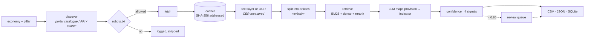

# VeriTrade — AI Tool for Digital Trade Regulatory Analysis

UN Global Hackathon on AI for Digital Trade Regulatory Analysis
Team: **FTU (Foreign Trade University, Viet Nam)** · Round: **Final**
Last updated: 2026-08-21

> Sections follow the order of the organisers' final-round README template, so a reviewer
> holding that template can read the two side by side.

---

## What This Tool Does

Automates the two RDTII 2.1 tasks end to end, with no manual steps.

**Task 1 — Automated Evidence Discovery.** Given an economy and a pillar, VeriTrade crawls
official government legal portals live, fetches the relevant legislation — including scanned
and image-only PDFs — and extracts clean, article-level text. **No seed URLs and no hardcoded
law names:** `data/sources.yaml` names *portals*, never statutes.

**Task 2 — Intelligent Mapping and Categorisation.** Each provision is mapped to a specific
RDTII indicator with an exact article citation, a verbatim snippet, a mapping rationale, a
confidence score, and a Discovery Tag — **per provision, not per law** (see
[Discovery Tag](#discovery-tag-is-decided-per-provision)).

- **Mandatory pillars:** 6 (Cross-border data policies) and 7 (Domestic data protection and privacy).
- **Also in scope:** all twelve RDTII 2.1 pillars. All **61 regulatory indicators** carry their
  scoring criteria and weights in `data/rdtii/indicator_reference.json`; the 14 non-regulatory
  indicators are recorded as out of scope, because the framework says an automated retrieval
  method is not required for them.
- **Economies covered:** Singapore, Australia, Malaysia, China, India, Mongolia, Thailand,
  Viet Nam, Indonesia, Kazakhstan, Lao PDR, Russian Federation.
- **Ready for the live test:** see [Supported Economies and Portals](#supported-economies-and-portals),
  which states per economy how far the tool has actually been run — not how far it could go.

---

## Hosted Instance (for reviewers — no setup, no API keys)

**https://veritrade.ftu.fyi** — the full interface, live, with keys held in platform secrets
and never in this repository. Pick a country and topic, press **Run analysis**, download the
submission CSV. It runs the code at the declared release tag. If it is briefly unreachable,
retry after a minute or use the Quick Start below.

---

## Quick Start

**Target: a working system on a clean machine in under 30 minutes, from this section alone.**
Steps 1–4 take about five minutes plus download time; step 5 is the run itself.

### 1. Clone

```bash
git clone https://github.com/ftulabs/law-v2.0.git
cd law-v2.0
```

### 2. Environment

```bash
# Python 3.10 – 3.12
python -m venv venv
source venv/bin/activate          # Windows: venv\Scripts\activate
pip install -r requirements.txt
```

First install pulls PyTorch and two small sentence-transformer models (~2 GB, several
minutes). No system binaries are needed: OCR is pip-only.

### 3. Configure

```bash
cp .env.example .env
```

**The tool runs with no key at all** — offline sample corpus, deterministic mock grader, $0 —
so you can reach step 5 before deciding anything. For real mapping, set one provider:

```env
LLM_PROVIDER=openrouter                        # or anthropic · openai · gemini · local · mock
OPENROUTER_API_KEY=sk-or-...
OPENROUTER_MODEL=deepseek/deepseek-v4-flash
OCR_PROVIDER=rapidocr                          # or paddle · tesseract · azure · vlm · mock
SERPER_API_KEY=...                             # optional; discovery falls back to free search
```

`.env` is gitignored and no key is committed.

### 4. Start the interface

```bash
streamlit run frontend/app.py
```

Then open **http://localhost:8501**. **Everything else happens in the interface** — starting a
run, reviewing, correcting, switching engines, exporting. You should not need the command line
again after this step. To skip the sign-in screen for a demo, set `AUTH_ENABLED=false` in `.env`.

### 5. Verify

In the interface choose **Singapore**, topic **Cross-border data policies**, press
**Run analysis**.

Expected on the offline sample: a populated coverage matrix in **under 2 minutes**, exported to
`outputs/`. Expected on a live run (`--live`, or the **Live portals** switch): roughly **6–9
minutes** for one economy and one pillar, most of it embedding on CPU.

If the first run is slow and prints nothing for a minute, that is the sentence-transformer
model loading; it is cached afterwards. If you see `402` from OpenRouter, the key has no
balance — switch `LLM_PROVIDER=mock` to confirm the rest of the pipeline works.

The equivalent from the command line, if you prefer it:

```bash
python main.py --economy Singapore --pillar 6            # offline sample, no key, no network
python main.py --economy Singapore --pillar 6 --live     # live crawl
python batch_run.py --economies Singapore Australia Malaysia --pillar 6 7 --live
```

---

## Your Interface

Criteria **C3a** and **C3b** are marked on the interface by someone who did not build it.

| What a reviewer needs to do | Where it is |
| :--- | :--- |
| Start a run and watch progress in plain words | Sidebar → *Country* → *Topic* → **Run analysis**. Progress shows as five named stages, not a log. |
| Open the audit view: a result beside the source text it came from | Tab **Details** → *Pick a result to inspect*. Shows the indicator's legal test, the verbatim quote, the surrounding source text, then the confidence breakdown. |
| Follow a row to its official source at the cited article | Tab **Results** → click any matrix cell → **Source URL** in the evidence panel. |
| Accept, reject or correct a row | Tab **Needs review** (the count in the tab label is the queue length). |
| Switch the AI engine | Tab **Engines** — on the main screen, not in a drawer. Each card states purpose, readiness, cost, and where the document goes. No file edited, no command typed. |
| Export to the RDTII schema | Tab **Download** → **Submission CSV** / **Evidence JSON** / **Scored CSV**. |

**Walkthrough recording:** *to be recorded before 30 September and submitted with the Word document.*

---

## Your Two Declared Engines

Required by **C4b** (No Vendor Lock-in) and tested live as **C5b**. Both engines are declared in
Section 5 of the Word submission on 30 September and **cannot change afterwards**.

|  | Engine A — commercial hosted | Engine B — open weights |
| :--- | :--- | :--- |
| Provider and model | *pending bake-off — see below* | *pending bake-off — see below* |
| Config value | `LLM_PROVIDER=openrouter` `LLM_MODEL=…` | `LLM_PROVIDER=local` `LLM_MODEL=…` |

> **Honest status.** The declaration is frozen on 30 September and cannot be revised, so we are
> not naming two engines before measuring them. The bake-off runs each candidate over
> `data/ground_truth/rdtii_reference_p67.csv` — 180 rows from the panel's own 2025 databases
> across six economies — and the two winners are declared. Candidates under test: DeepSeek and
> Gemini Flash on the hosted side; Qwen3 and gpt-oss-20b on the open-weights side.

The abstraction lives in `backend/providers/llm_factory.py`. Adding a provider means
implementing one class with `complete_json(system, user)` and registering it in that factory.

```env
LLM_PROVIDER=openrouter    # any model id in OPENROUTER_MODEL
LLM_PROVIDER=anthropic     # ANTHROPIC_API_KEY + ANTHROPIC_MODEL
LLM_PROVIDER=openai        # OPENAI_API_KEY + OPENAI_MODEL
LLM_PROVIDER=gemini        # GEMINI_API_KEY
LLM_PROVIDER=local         # Ollama / vLLM / LM Studio — LOCAL_LLM_BASE_URL, no key
LLM_PROVIDER=mock          # deterministic offline grader, $0
```

### Switching between them

**In the interface:** tab **Engines** → the engine card → select. No file is edited and no
command is typed; a steward watches this happen on 15 October.

### Re-running without fetching

A second pass reads documents already downloaded and fetches nothing new — its document list
is empty.

**In the interface:** sidebar → *Advanced settings* → leave **Fresh crawl** off (the default).
Downloaded documents are cached in **`cache/`**, named by the SHA-256 of their content, indexed
by URL in `cache/_index.json`. Delete that directory to force a genuine cold run. On the command
line, `--fresh` is the opposite: it ignores the cache and re-crawls.

---

## Crawling Politely

Built in and **on by default** — a ministry running this tool should not have to configure it,
and on 15 October five tools read the same government sites within the same hour.

| Setting | Value | Where it is set |
| :--- | :--- | :--- |
| Max requests per second per host | 0.5 (a 2-second gap) | [`backend/config.py:124`](backend/config.py#L124) `crawl_delay_seconds` |
| Parallel requests per host | 1 | [`backend/pipeline/fetch.py:62`](backend/pipeline/fetch.py#L62) `_polite_wait` |
| robots.txt respected | yes | [`backend/pipeline/robots.py`](backend/pipeline/robots.py), enforced at [`fetch.py:140`](backend/pipeline/fetch.py#L140) |

Details that matter more than the table:

- **The most specific user-agent group wins**, per RFC 9309, and the longest matching path rule
  wins within it. This is not pedantry: `peraturan.bpk.go.id` disallows nine *named* AI
  crawlers while granting the wildcard group, and VeriTrade identifies as
  `VeriTrade-Research/0.2`. Reading that file crudely either loses Indonesia or breaks a promise.
- **A host's own `Crawl-delay` wins when it is larger than ours.** Our setting is a floor on
  politeness, not a ceiling.
- **robots.txt is checked before the cache is read**, not only before the network, so a rule
  published after we fetched a body still governs whether we may use it.
- **An unreadable robots.txt denies.** A 4xx means the file is absent, which is permission; a
  5xx or a network failure is not.
- A skipped document is **logged by URL and reason**, never silently dropped.
- Two hosts sit on a narrow TLS-verification allowlist because their certificates are
  self-signed or expired ([`fetch.py:250`](backend/pipeline/fetch.py#L250)). The conditions
  under which that is acceptable are written above the allowlist.

---

## Architecture Overview

**Full system design with diagrams: [`docs/architecture.md`](docs/architecture.md)** — read that
if you are going to change the code.



The boundary between **fetching** and **reading** is explicit and is what makes the second pass
free: everything left of `cache/` touches the network, everything right of it does not.

Corpora at or below 80 provisions are graded **exhaustively** — every provision against every
indicator — so retrieval is a signal rather than a gate. This is why imperfect non-English
ranking does not cost recall.

### Key modules

| Module | File | Description |
| :--- | :--- | :--- |
| Portal Crawler | `backend/pipeline/discovery.py`, `robots.py`, `fetch.py`, `scrapling_fetch.py` | Navigates portals, retrieves source URLs, robots enforcement, caching |
| Document Processor | `backend/pipeline/ocr.py`, `extraction.py`, `backend/providers/ocr_*.py` | Download, OCR, structural parsing into verbatim articles |
| Retrieval | `backend/pipeline/retrieval.py`, `ranking.py` | Script-aware tokenisation, BM25 + dense, reranking |
| Mapper | `backend/pipeline/mapping.py`, `confidence.py` | Provision → RDTII indicator, 4-signal confidence |
| Indicators | `backend/rdtii/` | Legal tests, all-12-pillar reference, scoring, codes, baseline tags |
| Engine registry | `backend/providers/engine_profile.py`, `llm_factory.py`, `ocr_factory.py` | Which engine per economy, and the evidence for it |
| Interface | `frontend/app.py`, `matrix.py`, `runview.py`, `enginebench.py` | Run control, audit view, review, export |
| Output Writer | `backend/export/csv_export.py`, `json_export.py` | Writes the RDTII schema |
| Orchestrator | `backend/pipeline/orchestrator.py` | End-to-end run + SQLite audit trail |

---

## Swapping the OCR Engine

Change `OCR_PROVIDER` in `.env`, or pick it in the **Engines** tab. No code changes.

| Engine | Config value | Proprietary? | Notes |
| :--- | :--- | :--- | :--- |
| RapidOCR | `rapidocr` | no | Default. ONNX, pip-only, no system binary. **CER 1.11 %** measured on the bundled scanned notice |
| PaddleOCR | `paddle` | no | PP-OCRv5 per-script models. The Thai and East-Slavic recognisers live here |
| Tesseract | `tesseract` | no | Needs a system binary. The only offline option for Lao |
| Vision model | `vlm` | **optional** | Reads any script. Point `VLM_OCR_BASE_URL` at a local Ollama for open weights, or at a router for a hosted model |
| Azure Document Intelligence | `azure` | **yes** | Strongest on noisy gazette scans; needs endpoint + key |
| Mock | `mock` | no | Offline sidecar, $0 |

**The core pipeline runs with no proprietary API.** Azure is the only proprietary OCR option and
is never a default. The vision engine satisfies the same declaration when pointed at a locally
served open-weights model.

**Engines are chosen per economy, with a reason and an evidence grade** —
`python -m backend.providers.engine_profile` prints it. The registry states what an engine
family supports; the factory resolves against what is actually installed, and substitutes
rather than running a recogniser whose dictionary cannot spell the script. Measured
disqualifications behind those choices:

- PaddleOCR's East-Slavic dictionary (517 characters) contains no **Ө Ү ө ү** — Mongolian loses
  four letters, Kazakh sixteen.
- Its Latin dictionary (836 characters) carries **đ ă ơ ư** but none of the 45 precomposed
  Vietnamese tone forms, and `lang="vi"` loads that very model *without raising*.
- The English cross-encoder ranks the correct Chinese provision **last of five**, so a
  non-Latin economy never falls back to it.

---

## Supported Economies and Portals

Generated from the registries the pipeline reads, so it cannot claim a capability the code does
not have: `python tools/readiness.py`.

**declared** = resolves, language profile, OCR engine · **reachable** = a portal answered us ·
**extracted** = provisions produced · **measured** = scored against the panel's 2025 database.
Only *measured* is a claim about quality.

| Economy | Live-test nine | Language of source | Portal | Lane | OCR | Reranker | Run end to end? | Next blocker |
| :--- | :---: | :--- | :--- | :--- | :--- | :--- | :--- | :--- |
| Thailand | yes | Thai | www.krisdika.go.th (+1) | non_english | paddle | off | **declared** | TLS fixed; document path still unknown (404 on every path tried) |
| Viet Nam | yes | Vietnamese | vbpl.vn | non_english | vlm | off | **reachable** | no discovery adapter has produced provisions yet |
| Indonesia | yes | Indonesian | peraturan.bpk.go.id (+1) | non_english | rapidocr | off | **reachable** | no discovery adapter has produced provisions yet |
| China | yes | Chinese (Simplified) | www.gov.cn (+1) | non_english | rapidocr | off | **extracted** | no scored run against the 2025 database yet |
| India | yes | English | www.indiacode.nic.in (+1) | english | rapidocr | ms-marco | **declared** | portal is a JS shell — 200 with no statute text in the body |
| Kazakhstan | yes | Kazakh | adilet.zan.kz | non_english | vlm | off | **reachable** | no discovery adapter; robots closes the listing paths |
| Lao PDR | yes | Lao | laoofficialgazette.gov.la | non_english | vlm | off | **declared** | host does not resolve — the portal URL itself is wrong |
| Mongolia | yes | Mongolian | legalinfo.mn | non_english | vlm | off | **reachable** | no discovery adapter has produced provisions yet |
| Russian Federation | yes | Russian | publication.pravo.gov.ru | non_english | paddle | off | **reachable** | robots disallows `/File`; build the lane on the sitemap |
| Singapore | — | English | sso.agc.gov.sg | english | rapidocr | ms-marco | **measured** | — |
| Australia | — | English | www.legislation.gov.au (+1) | english | rapidocr | ms-marco | **measured** | — |
| Malaysia | — | English | lom.agc.gov.my (+2) | english | rapidocr | ms-marco | **measured** | — |

**Of the nine live-test economies today: 0 measured, 1 extracted, 5 reachable, 3 declared.**
Singapore, Australia and Malaysia are our deepest corpora but are *not* among the nine — the
panel holds no 2025 database for them.

Mongolia's statutes are served as **HTML**, not scanned PDF (measured: 12.4k Cyrillic characters
in the response body, zero PDF links, zero vertical Mongol Bichig), so OCR is not on its
critical path. The vision engine exists for the case where a scanned amendment appears anyway.

---

## Output Format

Columns are in this exact order — the same thirteen as Round 1, plus **Language of Source**.
Do not rename or reorder; the secretariat validates programmatically.
Source of truth: `backend/schemas.py` → `SUBMISSION_COLUMNS`.

| # | Column | Required | Description |
| :--- | :--- | :--- | :--- |
| 1 | Economy | Required | Official UN country name ("Viet Nam", "Lao People's Democratic Republic") |
| 2 | Law Name | Required | Full official statute name and year |
| 3 | Law Number / Ref | Optional | e.g. `Act 709`, `B.E. 2562` |
| 4 | Last Amended | Optional | Month + year when verified; `Original` when the portal shows none |
| 5 | Indicator ID | Required | **RDTII 2.1 code as text: `6.1`, `7.3`, `12.9`. Never `P6-I1`.** |
| 6 | Article / Section | Required | Exact article and paragraph, e.g. `s. 26(1)`, `Art. 26(2)` |
| 7 | Discovery Tag | Required | NEW = not in the 2025 baseline we hold; KNOWN = it was |
| 8 | Location Reference | Optional | PDF page number, or HTML anchor / section path |
| 9 | Verbatim Snippet | Required | Exact quoted text — no editing, no paraphrase, no translation |
| 10 | Mapping Rationale | Optional | ≤ 300 characters, naming the legal mechanism |
| 11 | Source URL | Required | Direct URL on the official government portal |
| 12 | Confidence | Optional | 0.00–1.00 |
| 13 | Notes | Optional | OCR issues, bilingual sources, cross-references, instrument warnings |
| 14 | Language of Source | Required | The document's original language, not the language we read it in |

**Indicator IDs are written as text.** Entered as a number, `12.10` collapses to `12.1` and
`4.01` to `4.1`, and those are different indicators. `backend/rdtii/codes.py` converts and then
checks the result against the 61 in-scope codes.

**Column 15, "Pillar (auto — do not edit)", is deliberately not written.** The workbook already
carries a formula there deriving it from the Indicator ID, and the Coverage Matrix reads that
formula's output. Writing a literal would overwrite it and silently empty every coverage count.

Indicators with no evidence get an explicit **"No provision found"** row — never left blank —
with `N/A` in Confidence and Discovery Tag.

### Discovery Tag is decided per provision

The template defines NEW per *provision*: "your tool found it and it is not in the 2025 baseline
you hold". Matching only the law name gives away our own credit — if the panel cites PDPA s.26
and our tool independently surfaces PDPA s.11(3), a law-level match reports the second one as
something we were handed.

`backend/rdtii/baseline.py` matches the law **and** the article, reducing both sides to a numeric
spine so `第四十条`, `14 дүгээр зүйл`, `s. 26(1)` and `APP 8` all compare. Where the baseline names
the law but no article, the honest answer is unknowable, so we report KNOWN and say so in Notes —
overstating our own discovery is the one error a judge can check against the database they wrote.

### JSON (`outputs/<economy>_P<pillar>_<timestamp>.json`)

Every CSV field plus `ocr_quality.cer`, `pdf_is_scanned`, `retrieval_log`, the confidence
breakdown, `raw_context_before/after`, `model_version`, and processing time.

---

## Measured Cost

**Measured 2026-07-12** · benchmark: one ~50-page Act, ~64 grading calls ·
`deepseek/deepseek-v4-flash` at $0.09 / $0.18 per 1M input / output tokens (OpenRouter,
verified) · Serper at $1.00 per 1,000 queries.

| Component | Engine used | Measured cost |
| :--- | :--- | :--- |
| OCR | RapidOCR (local) | $0.000 |
| Embedding | MiniLM + BM25 (local) | $0.000 |
| Mapping — Engine A | *pending declaration* | — |
| Mapping — Engine B | *pending declaration* | — |
| Mapping — current default | deepseek-v4-flash | **$0.012 / document** (~$0.0002 × 64 calls) |
| Crawling | Serper (optional) | **$0.19** per full 3-economy run; free tier covers it |
| **Total, current stack** | | **~$0.012 / document** + crawling |
| **Total, open-weights swap** | Ollama + RapidOCR + free search | **$0.00 / document** |

**Wall-clock:** 6–9 minutes per economy-pillar on a live run, CPU only, most of it embedding.

> **Honest status — this table is not yet produced automatically.** The template requires cost
> "recorded per run and per engine during the live hour … without manual arithmetic". LLM token
> counts come back in every API response and OCR/embedding are local and free, so every unit is
> measurable; what does not yet exist is the meter that threads through the pipeline and sums
> them per run. It is built before 30 September, and the figures above are re-measured with the
> declared engines at that point. Reproduce the current numbers with:
>
> ```bash
> python tools/cost_logger.py --pdf data/samples/AU/privacy_act.pdf --economy Australia --pillar 6
> ```

---

## Known Limitations

A tool that flags what it could not read is better built than one that presents everything with
equal confidence.

- **Six of the nine live-test economies have no discovery adapter yet.** Their portals answer,
  and OCR and language handling are in place, but nothing knows how to *enumerate* what laws
  exist on them. `websearch` is a fallback, not a plan — Malaysia proved it can return zero
  Acts in silence.
- **Confidence is relative, not a calibrated probability.** Below **0.85** a human should look;
  below **0.60** the row is quarantined and excluded from the submission by default.
- **Confidence is not comparable across language lanes.** Its `retrieval_score` component is on
  a different scale in each: the English lane's cross-encoder pulls the number down (measured:
  0.303 against 0.514) while the non-English lane has no cross-encoder. Two equally good rows
  from two economies therefore carry different confidence, and the fix — ranking within the
  shortlist instead of the raw score — is not yet applied because it moves every existing row.
- **The multilingual reranker is off by default.** It is 568M parameters against 23M and runs
  an order of magnitude slower; enabled, it turned one China pillar into an 11-hour run. Turning
  it off *raises* retrieval scores and changed 0 of 20 shortlist rows in the measurement above.
  Enable with `CROSS_ENCODER_MULTILINGUAL_ENABLED=true` if you have a GPU.
- **OCR accuracy is validated only for Latin script** (CER 1.11 %). No document-level CER exists
  for Thai, Lao, Mongolian or Kazakh from any engine, ours included; `validated=False` in
  `ocr_languages.py` marks every such case rather than quoting a vendor number as if it were CER.
- **The vision OCR engine can hallucinate.** Classical OCR degrades into visible noise; a vision
  model degrades into a fluent sentence that was never in the document. It is the last engine
  tried, runs at temperature 0, is instructed to write `[illegible]` rather than guess, and
  returns no confidence — we report `None` instead of inventing one.
- **The offline mock grader is lexical** and can confuse 6.1 with 6.4, or 7.1 with 7.2. Use a
  real LLM for anything submitted.
- **Live crawling depends on portal availability**; the bundled sample corpus is the fallback.

---

## Running the Test Suite

```bash
pytest tests/
```

**448 tests, all passing.** The ones worth knowing about:

| Test file | What it tests |
| :--- | :--- |
| `test_output.py` | The exact CSV schema the secretariat validates |
| `test_final_round.py` | The nine economies, `6.4` indicator codes, Language of Source, unscoreable instruments |
| `test_robots.py` | robots.txt enforcement against the real files the live-test portals serve |
| `test_baseline_tag.py` | Discovery Tag per provision, across four citation conventions |
| `test_multilingual.py` | Script-aware tokenisation, article boundaries, reranker selection |
| `test_scanned_ocr.py` | Real raster OCR, CER < 5 % on a bundled scan |
| `test_mapper.py` | Indicator mapping against known answers |
| `test_discovery.py` | Live discovery and in-force filtering |
| `test_scrapling_fetch.py` | Browser fetch and WAF bypass |
| `test_input.py` | Economy codes, UN names, typo tolerance |

---

## Reproducing Your Submitted Evidence

```bash
python batch_run.py --economies Singapore Australia Malaysia --pillar 6 7 --live
```

Regenerates the rows in the submitted workbook so a reviewer can compare them against what we
filed. Coverage against the panel's own answer key:

```bash
python evaluate.py --economy Singapore
```

Readiness table, engine profile, and portal reconnaissance:

```bash
python tools/readiness.py
python -m backend.providers.engine_profile
python tools/probe_portals.py --economy KZ
```

---

## Team

| Role | Responsibility |
| :--- | :--- |
| Technical Lead | AI architecture, OCR, discovery and retrieval pipeline |
| Substantive Lead | Legal and policy analysis, RDTII mapping, output QA |

Foreign Trade University (FTU), Viet Nam · contact: minhtc@ftu.edu.vn

---

## Licence

Released under the **Apache License 2.0**, as required. See [LICENSE](LICENSE).

**Release tag:** *set at submission on 30 September — that tag is what runs on 15 October.
Settings may change on the day; code may not.*

---

## Acknowledgements

Built for the UN Global Hackathon on AI for Digital Trade Regulatory Analysis, organised by
ESCAP and KMITL.
