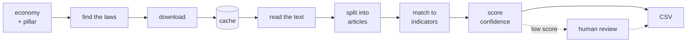

# VeriTrade — AI Tool for Digital Trade Regulatory Analysis

Autonomous discovery and article-level mapping of digital-trade law across twelve Asia-Pacific
economies. Submission for the UN ESCAP / KMITL Global Hackathon on AI for Digital Trade
Regulatory Analysis, 2026 — **Final round**.

- **Hosted instance:** https://veritrade.ftu.fyi — full interface, keys in platform secrets, no setup
- **Source:** https://github.com/ftulabs/law-v2.0
- **Team:** FTU (Foreign Trade University, Viet Nam) · minhtc@ftu.edu.vn

---

## Technical memo

**The question.** *Given an economy and a regulatory pillar, which provisions of which laws
satisfy which RDTII indicators — and where exactly are they?* By hand that means reading a
national statute book in its own language and citing to the paragraph.



Three things in that line are the whole design.

| | |
| :--- | :--- |
| **"find the laws"** | takes only the economy and the pillar. No seed URL, no law name. |
| **cache** | everything left of it uses the network; nothing right of it does. So a second run costs nothing and fetches nothing. |
| **"match to indicators"** | the model sees the indicator's legal test *and every sibling indicator*, so it must choose, not merely agree. |

**Every engine choice carries a reason.** Each economy resolves to a named OCR engine,
reranker and model, each tagged `measured` / `documented` / `assumed`, so a preference nobody
can justify is one we do not ship. `python -m backend.providers.engine_profile` prints it. The
registry says what an engine *supports*; the factory checks what is *installed* and substitutes
rather than running a recogniser whose dictionary cannot spell the script — which yields fluent
text with letters missing and raises nothing.

**Language and script are different questions.** Script decides how text is tokenised; language
decides whether the English reranker runs at all. Viet Nam and Indonesia use Latin letters and
still need the non-English lane.

**The quote is never rewritten.** The Verbatim Snippet column *is* the statute's own text —
carried unchanged from extraction to CSV, and substring-verified against the stored source. The
grading prompt is English and demands English *output*, but passes the snippet through
untouched: a translated citation is a false citation.

**Cost.** OCR, embedding and retrieval run locally at $0. Only the grading model and the
optional search API cost anything — **~$0.012 per document**, or **$0.00** on the open-weights
swap. See [Measured Cost](#measured-cost).

---

## Quick Start

**Target: a working system on a clean machine in under 30 minutes, from this section alone.**

```bash
git clone https://github.com/ftulabs/law-v2.0.git && cd law-v2.0

python -m venv venv && source venv/bin/activate     # Windows: venv\Scripts\activate
pip install -r requirements.txt                     # Python 3.10–3.12; ~2 GB, several minutes

cp .env.example .env                                # runs with NO key at all — see below
streamlit run frontend/app.py                       # → http://localhost:8501
```

**Verify.** In the interface pick **Singapore**, topic **Cross-border data policies**, press
**Run analysis**. Expected on the bundled sample: a populated coverage matrix in **under 2
minutes**, written to `outputs/`. A live run takes **6–9 minutes** per economy-pillar, most of
it embedding on CPU.

**After a `git pull`, restart the server.** Streamlit re-executes the main script on every
interaction but does not re-import modules that are already loaded, so a server left running
across a code change serves a mix of old and new files. It reports that as
`AttributeError: module 'frontend.geo' has no attribute 'readiness'` on a function that plainly
exists — the error names the symptom and not the cause. Ctrl-C and start it again.

**Everything else happens in the interface** — starting a run, reviewing, correcting, switching
engines, exporting. You should not need the command line again. `AUTH_ENABLED=false` skips the
sign-in screen for a demo.

**Keys are optional.** With none set, the tool runs the offline sample corpus through a
deterministic mock grader at $0, which is enough to reach the verify step. For real mapping:

```env
LLM_PROVIDER=openrouter        # or anthropic · openai · gemini · local · mock
OPENROUTER_API_KEY=sk-or-...
OCR_PROVIDER=rapidocr          # or paddle · tesseract · azure · vlm · mock
SERPER_API_KEY=...             # optional; discovery falls back to free search
```

`.env` is gitignored; no key is committed. The first run is slow while the sentence-transformer
model loads, then cached. A `402` from OpenRouter means the key has no balance — set
`LLM_PROVIDER=mock` to confirm the rest of the pipeline works.

<details>
<summary>Command line, if you prefer it</summary>

```bash
python main.py --economy Singapore --pillar 6                  # offline sample, no key, no network
python main.py --economy Singapore --pillar 6 --live           # live crawl
python main.py --economy Singapore --pillar 6 --live --fresh   # ignore caches, re-crawl
python batch_run.py --economies Singapore Australia Malaysia --pillar 6 7 --live
```
</details>

---

## Your Interface

Criteria **C3a** and **C3b** are marked on the interface by someone who did not build it.

The start screen is four **screens** — Run · Live test · Engines · Coverage — and a completed
run opens **tabs** beneath it. The split is deliberate: two of those four are needed when no
run exists yet, and a tab inside the results cannot be reached before the first run.

| What a reviewer needs to do | Where it is |
| :--- | :--- |
| Choose an economy, and see how far each one has been taken | Screen **Run** → the globe. Every economy is filled by its readiness — declared, reachable, extracted, measured — from `tools/readiness.py`. Drag to turn, arrow keys to move, or press a name |
| Choose a topic | Screen **Run** → twelve pillar chips. 6 and 7 are marked as the measured pair; the other ten say so in their tooltip |
| Start a run and watch progress in plain words | Screen **Run** → **Run analysis**. Five named stages, not a log |
| See what the tool can actually do, per economy | Screen **Coverage** — the readiness table, generated, with the next blocker for each |
| Open the audit view: a result beside the source text | Tab **Details** → *Pick a result to inspect* — legal test, verbatim quote, surrounding source, then confidence |
| Follow a row to its official source at the cited article | Tab **Results** → click a matrix cell → **Source URL** |
| Accept, reject or correct a row | Tab **Needs review** (the tab label carries the queue count) |
| Switch the AI engine | Screen **Engines**. No file edited, no command typed |
| Export to the RDTII schema | Tab **Download** → Submission CSV · Evidence JSON · Scored CSV, with this run's measured cost above them |
| Run the sealed live test on 15 October | Screen **Live test** — the steward names any economy and any pillar, and both pickers cover everything the tool declares. Four steps (brief → run → result → hand in) producing the run record, the engine comparison and the short note. Before the clock starts it states what to expect from that exact pair — an empty run from a *declared* economy and an empty run from a *measured* one look identical in the output and mean opposite things |

The globe is a textured WebGL earth (three.js from a CDN) with each economy's border traced
on it in the colour of its readiness. If the CDN is unreachable it falls back, after six
seconds, to a dependency-free canvas globe that draws the same data and says so in the corner —
an earlier version had only the CDN path, and its failure mode was an empty box with no error
anywhere. The world outline itself always ships locally
(`frontend/components/geo/world.json`, 117 KB), so *where* each economy is never depends on the
network; only the photography does.

**Walkthrough recording:** *to be recorded before 30 September, submitted with the Word document.*

---

## Your Two Declared Engines

Required by **C4b** (No Vendor Lock-in), tested again live as **C5b**. Declared in Section 5 of
the Word submission on 30 September and **cannot change afterwards**.

|  | Engine A — commercial hosted | Engine B — open weights |
| :--- | :--- | :--- |
| Provider and model | `openai/gpt-4o-mini` *(provisional)* | `mistralai/mistral-small-3.2-24b-instruct` *(provisional)* |
| Local or hosted | hosted API | open weights, served via OpenRouter; self-hostable on one GPU |
| Config value | `LLM_PROVIDER=openrouter` `OPENROUTER_MODEL=openai/gpt-4o-mini` | `LLM_PROVIDER=openrouter` `OPENROUTER_MODEL=mistralai/mistral-small-3.2-24b-instruct` |

Measured with `python tools/bakeoff.py`, over `data/benchmarks/grader_bakeoff.json` — 58 cases
whose 16 positives are the panel's own answer key joined to our extracted provision text and
then **read one by one** — using the production grading prompt.

| Model | | F1 | precision | recall | $/1k calls | s/call |
| :--- | :--- | ---: | ---: | ---: | ---: | ---: |
| `mistral-small-3.2-24b` | open | **0.903** | 0.933 | 0.875 | 0.304 | 2.8 |
| `gpt-4o-mini` | hosted | 0.812 | 0.812 | 0.812 | 0.591 | 2.2 |
| `gpt-oss-120b` | open | 0.800 | 0.857 | 0.750 | 0.256 | 20.0 |
| `deepseek-v4-flash` | open | 0.786 | 0.917 | 0.688 | 0.303 | 11.5 |

> **Provisional, and why.** Sixteen positives means a 0.09 gap is one and a half cases. Only
> two facts are firm: mistral-small reproduced 0.903 exactly across two independent runs and
> leads on precision *and* recall, and the previous default (deepseek-v4-flash) is last, missing
> 31% of the panel's own answers where mistral misses 12%. The benchmark grows as corpora are
> built for more economies, and the declaration is made against the larger set.
>
> Two measurement traps are recorded in `tools/build_bakeoff_set.py` because both nearly chose
> the wrong engine: an unverified benchmark scored every model 0.50–0.61 and ranked them
> differently, and a provider-side 429 storm scored the eventual winner 0.316.

**Switching:** interface → tab **Engines** → select. A steward watches this on 15 October; a
switch needing code or config scores zero.

**Re-running without fetching:** leave *Fresh crawl* off (the default). Downloaded documents
live in `cache/`, named by content hash, indexed in `cache/_index.json`. The second pass fetches
nothing and its document list is empty. Delete the directory to force a cold run.

Adding a provider means one class with `complete_json(system, user)` registered in
`backend/providers/llm_factory.py` → [docs/ARCHITECTURE.md](docs/ARCHITECTURE.md)

---

## Swapping the OCR Engine

Set `OCR_PROVIDER` in `.env`, or pick it in the **Engines** tab. No code changes.

| Engine | Config value | Proprietary? | Notes |
| :--- | :--- | :--- | :--- |
| RapidOCR | `rapidocr` | no | Default. ONNX, pip-only. **CER 1.11 %** measured on the bundled scan |
| PaddleOCR | `paddle` | no | PP-OCRv5 per-script models — the Thai and East-Slavic recognisers |
| Tesseract | `tesseract` | no | Needs a system binary; the only offline option for Lao |
| Vision model | `vlm` | optional | Reads any script — the fallback for Lao, Mongolian, Kazakh, Vietnamese. `qwen3-vl-8b` (Apache-2.0, MDPBench 68.3) by default; `gemini-3.1-pro` opt-in for the hardest pages |
| Azure Document Intelligence | `azure` | **yes** | Strongest on noisy gazette scans; needs endpoint + key |
| Mock | `mock` | no | Offline sidecar, $0 |

**The core pipeline runs with no proprietary API.** Azure is the only proprietary option and is
never a default; the vision engine satisfies the same declaration when pointed at a locally
served open-weights model.

**Which OCR engine, on what evidence.** Two public benchmarks were read before choosing.
[olmOCR-bench](https://huggingface.co/datasets/allenai/olmOCR-bench) is English-only — it
measures reading order, tables and header/footer exclusion, so it bears on extraction quality
and not at all on our hard scripts. [MDPBench](https://huggingface.co/datasets/Delores-Lin/MDPBench)
covers 17 languages and is the one that decides:

| | overall | vi | th | ru | id | zh | |
| :--- | ---: | ---: | ---: | ---: | ---: | ---: | :--- |
| Gemini-3-pro | **86.4** | 91.6 | 85.5 | 90.4 | 91.5 | 84.9 | proprietary · opt-in escalation |
| MonkeyOCRv2-S | 82.5 | 87.2 | **88.7** | 87.1 | 85.4 | 78.0 | open, but self-host only |
| Qwen3-VL-8B | 68.3 | 79.1 | 61.9 | 58.4 | 68.5 | 57.9 | open **and reachable** · our default VLM |
| PP-StructureV3 | 45.4 | 68.9 | 15.4 | 7.7 | 69.6 | 7.5 | Paddle's *pipeline* — see below |

Three things follow. Purpose-built document parsers beat general vision models by a wide
margin, and **none of them is served by any hosted router** — so a hosted fallback has to be a
general VLM, and Qwen3-VL-8B is the best-evidenced one we can actually reach (it also has
Apache-2.0 weights, so self-hosting keeps the no-proprietary-API declaration true). **Neither
benchmark covers Lao, Mongolian or Kazakh**, our three hardest scripts, so every number about
them is ours or nobody's. And PP-StructureV3's collapse on Thai and Cyrillic is a *warning, not
a verdict*: it scores Paddle's document-parsing pipeline on photographed pages, while we call
its per-script recogniser on pages we render from clean government PDFs. Quoting one as the
other would be the same category error as quoting line-level accuracy as CER — but it is why
those paths stay `validated=false` until measured here.

→ per-language evidence, and why Paddle is disqualified for Vietnamese, Mongolian and Kazakh:
[docs/OCR_LANGUAGE_EVIDENCE.md](docs/OCR_LANGUAGE_EVIDENCE.md)

---

## Crawling Politely

Built in and **on by default** — a ministry running this tool should not have to configure it,
and on 15 October five tools read the same government sites within the same hour.

| Setting | Value | Where it is set |
| :--- | :--- | :--- |
| Max requests per second per host | 0.5 (a 2-second gap) | [`config.py:233`](backend/config.py#L233) `crawl_delay_seconds` |
| Parallel requests per host | 1 | [`fetch.py:63`](backend/pipeline/fetch.py#L63) `_polite_wait` |
| robots.txt respected | yes | [`robots.py`](backend/pipeline/robots.py), enforced at [`fetch.py:141`](backend/pipeline/fetch.py#L141) |

A host's own `Crawl-delay` wins when larger than ours; an unreadable robots.txt denies; a
skipped document is logged by URL and reason, never silently dropped.

→ per-portal robots findings, and why user-agent matching has to be exact:
[docs/CRAWLING.md](docs/CRAWLING.md)

---

## Supported Economies and Portals

Generated from the registries the pipeline reads — `python tools/readiness.py` — so it cannot
claim a capability the code does not have.

**declared** = resolves, language profile, OCR engine · **reachable** = a portal answered ·
**extracted** = provisions produced · **measured** = scored against the panel's 2025 database.
Only *measured* is a claim about quality.

| Economy | Live-test nine | Language | Portal | Run end to end? | Next blocker |
| :--- | :---: | :--- | :--- | :--- | :--- |
| Thailand | yes | Thai | krisdika.go.th (+1) | declared | TLS fixed; document path unknown |
| Viet Nam | yes | Vietnamese | vbpl.vn | reachable | no discovery adapter yet |
| Indonesia | yes | Indonesian | peraturan.bpk.go.id (+1) | reachable | no discovery adapter yet |
| China | yes | Chinese | gov.cn (+1) | **extracted** | not yet scored against the 2025 database |
| India | yes | English | indiacode.gov.in (+2) | **extracted** | not yet scored across all 50 reference rows |
| Kazakhstan | yes | Kazakh | adilet.zan.kz | reachable | robots closes the listing paths |
| Lao PDR | yes | Lao | laoofficialgazette.gov.la | declared | host does not resolve |
| Mongolia | yes | Mongolian | legalinfo.mn | **extracted** | not yet scored against the 2025 database |
| Russian Federation | yes | Russian | publication.pravo.gov.ru | reachable | robots disallows `/File`; use the sitemap |
| Singapore | — | English | sso.agc.gov.sg | **measured** | — |
| Australia | — | English | legislation.gov.au (+1) | **measured** | — |
| Malaysia | — | English | lom.agc.gov.my (+2) | **measured** | — |

**Of the nine live-test economies today: 0 measured, 3 extracted, 4 reachable, 2 declared.**
Singapore, Australia and Malaysia are our deepest corpora but are *not* among the nine — the
panel holds no 2025 database for them.

**Mongolia, and two corrections in a row.** This row has been wrong twice, in opposite
directions, and both are worth keeping.

First it said the statutes arrive as HTML "so OCR is not on its critical path", on the strength
of 12.4k Cyrillic characters in the response body. Those characters are the navigation menu, a
sign-up form and an alphabet index — zero article headings. Counting a script without checking
what it spells is the same mistake that had India recorded as a JS shell when it had simply
moved.

Then it said the opposite: that discovery was solved and body retrieval was not. Also wrong,
and falsifiable in one request. The detail page's own toolbar calls
`downloadAnnexFile(this, '', lawId)`, which resolves to
`POST /mn/downloadFile?file=&lawId=N&fDownload=1` and returns the whole instrument — labelled
`.doc`, but the bytes are UTF-8 HTML, so **Mongolia needs no OCR at all**. Discovery is
`/sitemap.xml` (36,833 `lawId`); titles come from `data/catalogues/MN_titles.json`, a table of
contents built once by `tools/build_mn_catalogue.py` and holding no provision text.

Measured, live, 2026-08-22: pillar 6 in 145 s for $0.09, mapping 6.4 to articles 14 and 8 of
Хүний хувийн мэдээлэл хамгаалах тухай — the one pillar-6 indicator Mongolia scores on in the
panel's key, with 6.1/6.2/6.3 correctly empty. Pillar 7 in 262 s for $0.21, with 7.1 and 7.4 on
the same Act and 7.2 on Кибер аюулгүй байдлын тухай. Three of five land on the instrument the
panel names; 7.3 and 7.5 find different ones.

---

## Output Format

Fourteen columns, this exact order: the thirteen from Round 1 unchanged, plus **Language of
Source**. Source of truth is `SUBMISSION_COLUMNS` in `backend/schemas.py`.

| # | Column | Req. | Notes |
| :--- | :--- | :--- | :--- |
| 1 | Economy | ✓ | Official UN name — "Viet Nam", "Lao People's Democratic Republic" |
| 2 | Law Name | ✓ | Full official name and year |
| 3 | Law Number / Ref | | `Act 709`, `B.E. 2562` |
| 4 | Last Amended | | Month + year when verified; `Original` when the portal shows none |
| 5 | Indicator ID | ✓ | **RDTII 2.1 code as text: `6.1`, `7.3`, `12.9`. Never `P6-I1`** |
| 6 | Article / Section | ✓ | `s. 26(1)`, `Art. 26(2)` — the section, not just the act |
| 7 | Discovery Tag | ✓ | NEW / KNOWN, decided **per provision** |
| 8 | Location Reference | | PDF page, or HTML anchor |
| 9 | Verbatim Snippet | ✓ | Exact text — no editing, paraphrase or translation |
| 10 | Mapping Rationale | | ≤ 300 chars, naming the legal mechanism |
| 11 | Source URL | ✓ | Direct URL on the official portal |
| 12 | Confidence | | 0.00–1.00 |
| 13 | Notes | | OCR issues, bilingual sources, instrument warnings |
| 14 | Language of Source | ✓ | The document's original language, not the one we read it in |

Three rules that cost rows if broken:

- **IDs are text.** Entered as a number, `12.10` collapses to `12.1` and `4.01` to `4.1` — four
  different indicators. `backend/rdtii/codes.py` converts and checks against the 61 in-scope codes.
- **Column 15, "Pillar (auto)", is deliberately not written.** The workbook holds a formula
  there and the Coverage Matrix reads it; a literal would silently empty every coverage count.
- **Discovery Tag is per provision, not per law.** If the panel cites PDPA s.26 and we
  independently surface s.11(3), a law-level match would report our own find as something we
  were handed. `backend/rdtii/baseline.py` matches law *and* article, reducing `第四十条`,
  `14 дүгээр зүйл`, `s. 26(1)` and `APP 8` to a common numeric spine.

Indicators with no evidence get an explicit **"No provision found"** row, never a blank. The
JSON adds `ocr_quality.cer`, `pdf_is_scanned`, `retrieval_log`, the confidence breakdown,
surrounding source context, and `model_version`.

---

## Measured Cost

**Produced by the code, not by a calculator.** `backend/metering.py` counts every billable unit
as it is spent — token counts from each API response, OCR pages per engine, search queries,
bytes fetched — and every run writes the table into its JSON under `run.cost`. The template's
condition is that logging produces this "without manual arithmetic", so nothing here is
estimated and nothing is entered by hand.

Below is a real run: **Singapore, pillar 6, offline sample corpus, 72s**
(`run-3e07213f`, prices from `data/pricing.json`).

| Component | Units | Measured cost |
| :--- | :--- | ---: |
| OCR — rapidocr | 0 pages (this corpus is HTML/text) | $0.0000 |
| Embedding — MiniLM + BM25, local | — | $0.0000 |
| Mapping — deepseek/deepseek-v4-flash | 64 calls · 219,036+27,787 tokens | **$0.0200** |
| Mapping — google/gemini-2.5-flash | 6 calls · 21,074+1,038 tokens | **$0.0089** |
| Crawling — search | 0 queries (offline run) | $0.0000 |
| **Total** | | **$0.0289** |

Two things the hand-calculated figure had wrong, and metering found immediately:

- **The cross-check lane was missing from the bill.** A second model re-grades borderline
  rejections, and those 6 calls are **31% of this run's cost**. The old README counted only the
  primary model and reported ~$0.012 per document.
- **Token counts are not the prompt size.** 64 grading calls consumed 219k prompt tokens, well
  above a per-call estimate, because the sibling-indicator context travels with every call.

`total_is_complete` is `false` whenever any component has no price on file, and the total is
then reported as a floor rather than an answer — a missing price shows as *unpriced*, never as
$0.00. Refresh rates from the providers' own endpoints with
`python tools/refresh_prices.py`.

Paid OCR would change the shape of this bill rather than adding to it: at list price a 50-page
Act costs more in OCR than the whole mapping run does in tokens. That is why local OCR is the
default and `tests/test_metering.py` pins the comparison.

---

## Known Limitations

A tool that flags what it could not read is better built than one that presents everything with
equal confidence.

- **Six of the nine live-test economies have no discovery adapter.** Their portals answer and
  their language handling is in place, but nothing yet enumerates what laws exist on them.
- **Confidence is relative, not a calibrated probability.** Below 0.85 a human should look;
  below 0.60 the row is quarantined and excluded from the submission by default.
- **Confidence is not comparable across language lanes.** Its retrieval component sits on a
  different scale in each (measured: 0.303 with the cross-encoder against 0.514 without), so two
  equally good rows from two economies carry different numbers. The fix — ranking within the
  shortlist rather than the raw score — is not applied because it moves every existing row.
- **The multilingual reranker is off by default.** 568M parameters against 23M, an order of
  magnitude slower; enabled, it turned one China pillar into an 11-hour run. Turning it off
  *raises* retrieval scores and changed 0 of 20 shortlist rows.
  Set `CROSS_ENCODER_MULTILINGUAL_ENABLED=true` if you have a GPU.
- **OCR accuracy is validated only for Latin script** (CER 1.11 %). No document-level CER exists
  for Thai, Lao, Mongolian or Kazakh from any engine, ours included.
- **The vision OCR engine can hallucinate.** Classical OCR degrades into visible noise; a vision
  model degrades into a fluent sentence that was never in the document. It is the last engine
  tried, runs at temperature 0, writes `[illegible]` rather than guessing, and returns no
  confidence — we report `None` rather than inventing one.
- **The offline mock grader is lexical** and can confuse 6.1 with 6.4, or 7.1 with 7.2. Use a
  real LLM for anything submitted.
- **Live crawling depends on portal availability**; the bundled sample corpus is the fallback.

---

## Docs

| Doc | What it covers |
| :--- | :--- |
| [docs/ARCHITECTURE.md](docs/ARCHITECTURE.md) | **System design.** Part I orients a new contributor with diagrams; Part II is the reference — schemas, formulas, and why the confidence weights are what they are |
| [docs/CRAWLING.md](docs/CRAWLING.md) | **Politeness and robots.txt** — per-portal findings, and why user-agent matching has to be exact |
| [docs/OCR_LANGUAGE_EVIDENCE.md](docs/OCR_LANGUAGE_EVIDENCE.md) | Per-language OCR evidence: what was measured, what is only documented, what is a gap |
| [docs/retrieval-redesign.md](docs/retrieval-redesign.md) | How the retrieval parameters were swept, and two counter-intuitive results not to re-litigate |
| [docs/round2-expansion.md](docs/round2-expansion.md) | Multilingual expansion — tokenisation, article boundaries, the grading prompt for non-English text |
| [docs/AUTH_AND_DATABASE.md](docs/AUTH_AND_DATABASE.md) | Accounts, sessions, and the one env var that moves storage to cloud Postgres |
| [docs/NOTES_FOR_JUDGES.md](docs/NOTES_FOR_JUDGES.md) | Decisions a reviewer may want the reasoning for |
| [docs/precompute-corpus.md](docs/precompute-corpus.md) | The precomputed corpus layers (L0–L3), currently paused |

---

## Repo layout

```
backend/
  pipeline/     discovery · robots · fetch · ocr · extraction · retrieval · mapping · orchestrator
  providers/    LLM and OCR factories, per-economy engine profile, language registry
  rdtii/        indicator legal tests · 12-pillar reference · scoring · codes · baseline tags
  export/       the 14-column CSV and the JSON trace
  eval/         labels from the panel's database, retrieval metrics, sweepable ranker
frontend/       Streamlit interface — matrix · run view · engine bench
data/
  sources.yaml  portals, never laws
  samples/      offline corpus for a keyless run
  rdtii/        indicator_reference.json — all 61 in-scope indicators
  ground_truth/ rdtii_reference_p67.csv — 180 rows from the panel's own databases
tools/          readiness · portal probe · retrieval sweep · reference builders
tests/          452 tests
```

---

## Running the Test Suite

```bash
pytest tests/
```

**452 tests.** The ones worth knowing: `test_output.py` (the exact CSV schema the secretariat
validates) · `test_final_round.py` (the nine economies, `6.4` codes, Language of Source,
unscoreable instruments) · `test_robots.py` (against the real files the live-test portals serve)
· `test_baseline_tag.py` (Discovery Tag per provision) · `test_multilingual.py` (script-aware
tokenisation and reranker selection) · `test_scanned_ocr.py` (CER < 5 % on a bundled scan).

## Reproducing Your Submitted Evidence

```bash
python batch_run.py --economies Singapore Australia Malaysia --pillar 6 7 --live
python evaluate.py --economy Singapore      # coverage against the panel's answer key
python tools/readiness.py                   # the economies table above
python -m backend.providers.engine_profile  # per-economy engine choices and their evidence
```

## Team

| Role | Responsibility |
| :--- | :--- |
| Technical Lead | AI architecture, OCR, discovery and retrieval pipeline |
| Substantive Lead | Legal and policy analysis, RDTII mapping, output QA |

## Licence

**Apache License 2.0**, as required — see [LICENSE](LICENSE).

**Release tag:** *set at submission on 30 September; that tag is what runs on 15 October.
Settings may change on the day, code may not.*

Built for the UN Global Hackathon on AI for Digital Trade Regulatory Analysis, organised by
ESCAP and KMITL.
