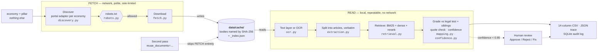

# VeriTrade — AI Tool for Digital Trade Regulatory Analysis

UN Global Hackathon on AI for Digital Trade Regulatory Analysis — final round submission
Team: **FTU** (Foreign Trade University, Viet Nam) | Round: **Final**
Last updated: 2026-09-30

[](LICENSE)


| | |
| :--- | :--- |
| **Hosted instance** | https://veritrade.ftu.fyi — the full interface, no setup |
| **Source** | https://github.com/ftulabs/law-v2.0 |
| **Documentation** | [docs/](docs/README.md) — architecture, deployment, crawling, OCR evidence |
| **Contact** | minhtc@ftu.edu.vn |

---

## Contents

[What This Tool Does](#what-this-tool-does) ·
[Quick Start](#quick-start) ·
[Your Interface](#your-interface) ·
[Your Two Declared Engines](#your-two-declared-engines) ·
[Crawling Politely](#crawling-politely) ·
[Architecture Overview](#architecture-overview) ·
[Swapping the OCR Engine](#swapping-the-ocr-engine) ·
[Supported Economies and Portals](#supported-economies-and-portals) ·
[Output Format](#output-format) ·
[Measured Cost](#measured-cost) ·
[Known Limitations](#known-limitations) ·
[Running the Test Suite](#running-the-test-suite) ·
[Reproducing Your Submitted Evidence](#reproducing-your-submitted-evidence) ·
[Team](#team) ·
[Licence](#licence) ·
[Acknowledgements](#acknowledgements)

---

## What This Tool Does

VeriTrade automates the two tasks of the ESCAP Regional Digital Trade Integration Index
(RDTII 2.1):

**Task 1 — Automated Evidence Discovery.** Given an economy and a pillar — and nothing else, no
seed URL and no law name — the tool finds the relevant legislation on the economy's official
legal portal, downloads it politely (robots.txt respected), and extracts clean, article-level
text from HTML, text-layer PDFs and scanned PDFs.

**Task 2 — Intelligent Mapping and Categorisation.** Each provision is matched to an RDTII 2.1
indicator by a language model that sees the indicator's legal test *and every sibling
indicator*, so it has to choose rather than agree. Every accepted row is re-checked by quotation
against the statute text. Each row carries an article-level citation, a verbatim snippet, a
confidence score and a Discovery Tag (**NEW** = found independently, **KNOWN** = matches a
provision in the panel's 2025 baseline, decided per provision).

| | |
| :--- | :--- |
| **Mandatory pillars** | 6 (Cross-border data policies) and 7 (Domestic data protection and privacy) — definitions measured against the panel's answer key |
| **Other pillars** | All twelve RDTII 2.1 pillars are selectable. Pillars 1–5 and 8–12 are *declared*: their 52 indicators are coded from the RDTII Methodology in [`backend/rdtii/indicators_wide.py`](backend/rdtii/indicators_wide.py) but have **not** been measured against an answer key |
| **Economies covered** | 11: Singapore, Australia, Malaysia (mandatory) + China, India, Indonesia, Lao PDR, Mongolia, Russian Federation, Thailand, Timor-Leste (the panel's list of eight) |
| **Run end to end, live** | 9 of 11: SG, AU, MY, CN, IN, MN, TH, RU, ID. Lao PDR and Timor-Leste reach extracted provisions but have not had a full live run |
| **Not supported** | Viet Nam and Kazakhstan. They are named in the template but are not on the panel's published list (verified against the Finalist Orientation slides); support for both was removed on 2026-08-30 |

---

## Quick Start

> Target: a working system on a clean machine in under 30 minutes, from this section alone.
> **Measured 2026-09-29 on a machine with nothing cached: 13 minutes** from `git clone` to a
> healthy app, plus 1 minute for the check in step 5. Needs **Docker** (Docker Desktop on
> Windows/macOS) and git. Without Docker: [Python path](docs/DEPLOYMENT.md#3-path-b--python-virtual-environment).

### 1. Clone the repository

```bash
git clone https://github.com/ftulabs/law-v2.0.git
cd law-v2.0
```

### 2. Set up the environment

Nothing to install on the host besides Docker — the image carries Python, the models, OCR and
the headless browser that Indonesia's portal requires. Start Docker Desktop and check:

```bash
docker compose version            # prints "Docker Compose version v2…"
```

### 3. Configure

```bash
cp .env.example .env              # Windows (cmd): copy .env.example .env
```

Open `.env` and set your key (everything else already holds the declared defaults):

```env
OPENROUTER_API_KEY=sk-or-...      # https://openrouter.ai/keys — needs credit
AUTH_ENABLED=false                # optional: skip the sign-in screen
```

With **no key at all** the tool still runs: the grader falls back to an offline stand-in
(`mock`) and the run log says so in an `[error]` line — enough to verify the install, not to
produce evidence. The key can also be pasted on the **Engines** screen instead of `.env`.
The two declared engines are described [below](#your-two-declared-engines).

### 4. Start the interface

```bash
docker compose up -d --build      # first time ~10–15 min; afterwards `docker compose up -d`, seconds
```

Then open **http://localhost:8501**. If `AUTH_ENABLED` is left on, choose **Create account** on
the first screen (accounts are kept in the container's `vt-outputs` volume).

**Everything else happens in the interface** — starting a run, reviewing, correcting, switching
engines, exporting. A reviewer does not need the command line again after this step.

### 5. Verify

```bash
docker compose exec veritrade python main.py --economy Singapore --pillar 6
```

**Expected:** `[done] 6 mappings in ~55s` and `outputs/SG_P6_<time>.csv` / `.json` — 3 bundled
documents → 16 provisions → 6 rows (PDPA ss. 26, 26A, 26D under 6.1, 6.2, 6.4, plus an explicit
"No provision found" row for 6.3). The same from the interface: **Run** screen → Singapore →
topic **6** → *Where to look* **Offline samples** → **Run analysis**.

Then switch to **Live portals** and run again with a key set: 3–7 minutes per pillar (discovery,
~22 downloads, extraction, grading); see [Measured Cost](#measured-cost).

| First-run symptom | Fix |
| :--- | :--- |
| `Cannot connect to the Docker daemon` | Docker Desktop is not running — start it and wait for *Engine running* |
| Port 8501 is already in use | Stop the other app, or change `"8501:8501"` to `"8502:8501"` in `docker-compose.yml` and open port 8502 |
| The first run after a start pauses about 30 s before grading | The embedding and reranking models are loading; the interface starts loading them in the background at launch |
| An `[error]` line says the run "fell back to the OFFLINE STAND-IN grader" | No usable API key. Set `OPENROUTER_API_KEY` in `.env`, or paste one on the **Engines** screen |
| OpenRouter answers `402` or `403 Key limit exceeded` | The key has no credit, or has hit its daily cap. It is not a dead key |
| Code changes do not appear after a `git pull` | Rebuild: `docker compose up -d --build` |
| On Windows, code changes do not appear after a restart | An old Streamlit process still owns port 8501. Stop it with `Stop-Process` in PowerShell |

<details>
<summary>The same pipeline from the command line</summary>

Inside Docker, prefix each command with `docker compose exec veritrade`.

```bash
python main.py --economy Singapore --pillar 6                  # offline sample corpus
python main.py --economy Singapore --pillar 6 --live           # live portals
python main.py --economy Singapore --pillar 6 --live --fresh   # ignore the stored-result cache
python batch_run.py --economies Singapore Australia Malaysia --pillar 6 7 --live
```

`python run.py --country SG --pillar 6` is an alias of `main.py`.
</details>

---

## Your Interface

The start surface has four **screens** — **Run · Live test · Engines · Coverage** — chosen from
the bar at the top. A completed run opens five **tabs** beneath it — **Results · Needs review ·
Details · Download · Engines**.

| What a reviewer needs to do | Where it is |
| :--- | :--- |
| Start a run and watch progress in plain words | Screen **Run** → pick a country on the globe (or by name), a topic chip, then **Run analysis**. Progress is shown as five named stages with counters, not a log; the raw log is in a collapsed expander |
| Open the audit view: a result beside the source text it came from | Tab **Details** → **Pick a result to inspect**. Shows the law, article, exact quote, the source link and the confidence breakdown. Tab **Results** → press any matrix cell for the same evidence panel, led by the indicator's legal test |
| Follow a row to its official source at the cited article | Tab **Results** → press a cell → the link at the foot of the evidence panel (or **Source ·** on the **Details** tab). It opens the document on the official portal; the cited article and PDF page are shown beside it (`Article / Section`, `Location Reference`) |
| Accept, reject or correct a row | Tab **Needs review · N** → per row: **Approve**, **Reject**, or type a new indicator ID and press **Fix indicator**. An optional **Note** is saved with each decision to the audit log |
| Switch the AI engine | Screen **Engines** (or tab **Engines** after a run) → **Use this** on a provider card → pick the **Model** and, if needed, paste the API key. For the live test: screen **Live test** → **Engine A / Engine B — provider** and **— model** |
| Export to the RDTII schema | Tab **Download** → **Submission CSV** (14 columns), **Evidence JSON** (full trace), **Scored CSV** (optional). The **Submission set only** toggle (on by default) leaves out rejected and set-aside rows |

The **Coverage** screen shows, for every economy, how far the tool has been taken
(declared → reachable → extracted → measured) and the next blocker.

**Walkthrough recording:** *to be added — recorded before 30 September and submitted with the
Word document.*

---

## Your Two Declared Engines

Declared in Section 5 of the Word submission on 30 September and fixed from then on. The
declaration is in code, so the interface, the run record and this table read the same values:
[`backend/config.py`](backend/config.py#L76-L79) (`declared_engine_a_*`, `declared_engine_b_*`).

> **Note on column order.** The organisers' template labels Engine A "commercial hosted" and
> Engine B "open weights". Our declaration is the other way round: **Engine A is the
> open-weights model** (the production grader) and **Engine B is the closed, hosted model**.
> The headers below state what each engine actually is.

| | Engine A — open weights | Engine B — commercial hosted |
| :--- | :--- | :--- |
| Provider and model | DeepSeek V4 Flash | Google Gemini 3.7 Flash |
| Version / checkpoint | `deepseek/deepseek-v4-flash` (OpenRouter model id) | `google/gemini-3.7-flash` (OpenRouter model id) |
| Local or hosted API | Hosted via OpenRouter; open weights, so it can be self-hosted behind `LLM_PROVIDER=local` | Hosted API via OpenRouter |
| Config value | `LLM_PROVIDER=openrouter` `OPENROUTER_MODEL=deepseek/deepseek-v4-flash` | `LLM_PROVIDER=openrouter` `OPENROUTER_MODEL=google/gemini-3.7-flash` |

There is no separate `LLM_MODEL` variable: each provider has its own model variable
(`OPENROUTER_MODEL`, `ANTHROPIC_MODEL`, `OPENAI_MODEL`, `GEMINI_MODEL`, `LOCAL_LLM_MODEL`).
Reasoning is switched off for engine A (`OPENROUTER_REASONING=off`); Gemini 3.7 Flash cannot
switch it off and runs with its own default.

Two helper models run alongside whichever engine grades, both on OpenRouter:

| Role | Model | Setting |
| :--- | :--- | :--- |
| Second-pass quote check on every accepted row (7.1 exempt) | `deepseek/deepseek-v4-pro-0813` | `VERIFY_MODEL`, `VERIFY_ENABLED` |
| Second opinion on borderline rejections (max 40 calls a run) | `qwen/qwen3-30b-a3b-instruct-2507` | `crosscheck_model`, `crosscheck_enabled` |

Why these engines, on what evidence (a 28-row bench of real rows, LegalBench, the superseded
58-case bake-off): [docs/ARCHITECTURE.md → Engine choice](docs/ARCHITECTURE.md#iii1-engine-choice-and-the-evidence-for-it).

### Switching between them

In the interface: **Engines** screen → **OpenRouter** card (**Use this**, or already marked
**In use**) → **Model** list below the cards → select `google/gemini-3.7-flash` (or
`deepseek/deepseek-v4-flash`). No file is edited and no
command typed; the next run uses the selected engine.

On 15 October: **Live test** screen → step 1 lists **Engine A** and **Engine B** with their
provider, model and an optional per-engine API key (held for the session only) → **Start the
clock** → **Run engine A**, then **Run engine B**.

The abstraction lives in [`backend/providers/llm_factory.py`](backend/providers/llm_factory.py)
(`get_llm_provider`). Adding a provider means one class implementing
`complete_json(system, user)` (see `backend/providers/llm_base.py`), one branch in
`get_llm_provider`, and one entry in `LLM_PROVIDERS` in `backend/providers/registry.py`.

### Re-running without fetching

In the interface: **Live test** screen → after **Run engine A** has finished, press **Run engine
B**. Engine B re-reads exactly the documents engine A downloaded — discovery and fetching are
skipped, no portal is contacted, and the run log says *"second pass — reusing N documents from
the first, no portal was contacted"*. Code path: `run_pipeline(reuse_documents=...)` in
[`backend/pipeline/orchestrator.py`](backend/pipeline/orchestrator.py#L422).

Where downloaded documents are cached: **`data/cache/`** — one file per document named by the
SHA-256 of its content, indexed by URL in `data/cache/_index.json` (`CACHE_DIR` in `.env`).

**The comparison is produced natively.** After both passes: **Compare** step → a table of every
provision either engine exported (found by both / A only / B only, and for shared provisions
whether the indicator, the article citation or the quoted words differ), with elapsed time and
cost per engine above it. **Hand in** step → **Provision comparison (.csv)**, **Engine
comparison (.csv)**, **Run record (.csv)**, both engines' evidence files and the short note.
Code: [`backend/export/engine_compare.py`](backend/export/engine_compare.py).

<details>
<summary>Not the same thing: the Run screen's "Search again" box</summary>

The **Search again** checkbox on the Run screen is ticked by default, so **Run analysis** always
searches the portals and grades afresh. Unticking it returns a *stored result* when the same
analysis ran within the last 30 days on the same code version — no model is called and nothing
is re-read; the screen marks it as saved. That is a result cache (`data/cache/_results/`), not a
second pass over documents.

Separately, a live run reuses a downloaded body younger than `FETCH_TTL_HOURS` (default 24)
without a network request; robots.txt is still checked first.
</details>

---

## Crawling Politely

Built in and on by default — nothing to configure.

| Setting | Value | Where it is set |
| :--- | :--- | :--- |
| Max requests per second per host | 1 (a 1-second gap per host; 2 s for `sso.agc.gov.sg`, which answers pressure with empty pages; a larger `Crawl-delay` from the host wins) | [`backend/config.py:284`](backend/config.py#L284) `crawl_delay_seconds`, applied in [`backend/pipeline/fetch.py:106`](backend/pipeline/fetch.py#L106) `_polite_wait` |
| Parallel requests per host | 1 (documents are fetched one after another) | [`backend/pipeline/orchestrator.py:640`](backend/pipeline/orchestrator.py#L640) — sequential fetch loop |
| robots.txt respected | yes | [`backend/config.py:292`](backend/config.py#L292) `crawl_respect_robots`; enforced at [`backend/pipeline/fetch.py:184`](backend/pipeline/fetch.py#L184) (downloads) and [`backend/pipeline/portal.py:93`](backend/pipeline/portal.py#L93) (portal listing pages) |

- A skipped URL is logged with its reason, never dropped silently.
- A robots.txt that answers with a server error is treated as *disallowed*, except for hosts
  listed in [`UNREACHABLE_OVERRIDE`](backend/pipeline/robots.py#L265) (RFC 9309 §2.3.1.4: a
  server error is not a refusal). Each use is logged.
- Where a portal gates pages behind a JavaScript challenge (Indonesia), a real browser runs the
  challenge as a visitor's browser would; robots.txt still decides which paths are fetched.

**Discovery adapters too.** Adapters that page through a portal's own index (SG, TH, LA, TL)
sleep `crawl_delay_seconds` between index pages (Singapore: its 2 s per-host floor). China's gazette lane (`cn_gazette`) reads
`www.gov.cn` one request at a time, each starting at least 1 s after the previous one ended;
on a new machine its cache takes about two hours to warm, spread across runs or done ahead with
`python -m backend.pipeline.adapter_cn_gazette --warm`, after which a run needs about four
requests.

Per-portal robots findings: [docs/CRAWLING.md](docs/CRAWLING.md).

---

## Architecture Overview


```mermaid
flowchart LR
    IN["economy + pillar<br/><i>nothing else</i>"]

    subgraph NET["FETCH — network, polite, rate-limited"]
        direction TB
        D["Discover<br/>portal adapter per economy<br/><code>discovery.py</code>"]
        R{{"robots.txt<br/><code>robots.py</code>"}}
        F["Download<br/><code>fetch.py</code>"]
        D --> R -->|allowed| F
    end

    C[("<b>data/cache/</b><br/>bodies named by SHA-256<br/>+ _index.json")]

    subgraph LOCAL["READ — local, repeatable, no network"]
        direction TB
        O["Text layer or OCR<br/><code>ocr.py</code>"] --> X["Split into articles, verbatim<br/><code>extraction.py</code>"]
        X --> RT["Retrieve: BM25 + dense + rerank<br/><code>retrieval.py</code>"]
        RT --> M["Grade vs legal test + siblings<br/>quote check · confidence<br/><code>mapping.py</code> · <code>confidence.py</code>"]
    end

    OUT["14-column CSV · JSON trace<br/>SQLite audit log"]
    REV["Human review<br/>Approve / Reject / Fix"]

    IN --> D
    F -->|writes| C
    C -->|reads| O
    M --> OUT
    M -. "confidence < 0.85" .-> REV -.-> OUT
    SP["Second pass<br/>reuse_documents=…"] -. "skips FETCH entirely" .-> C
```

**The fetch/read boundary is the cache.** Everything left of `data/cache/` uses the network;
nothing right of it does. The second pass enters at the cache with engine A's document list,
so it fetches nothing. Full design, including how to add an economy or an engine:
[docs/ARCHITECTURE.md](docs/ARCHITECTURE.md).

### Key modules

| Module | File | Description |
| :--- | :--- | :--- |
| Portal Crawler | [`backend/pipeline/discovery.py`](backend/pipeline/discovery.py), `backend/pipeline/adapter_*.py`, [`data/sources.yaml`](data/sources.yaml) | One adapter per portal (API, catalogue, gazette index, site search); `sources.yaml` names portals, never laws |
| Document Processor | [`backend/pipeline/fetch.py`](backend/pipeline/fetch.py), [`ocr.py`](backend/pipeline/ocr.py), [`extraction.py`](backend/pipeline/extraction.py), `backend/providers/ocr_*.py` | Download to cache; text layer or OCR (CER measured); per-economy article splitting |
| Retrieval | [`backend/pipeline/retrieval.py`](backend/pipeline/retrieval.py), [`ranking.py`](backend/pipeline/ranking.py), [`retrieval_budget.py`](backend/pipeline/retrieval_budget.py) | Script-aware BM25 + multilingual MiniLM + cross-encoder; per-economy shortlist depth |
| Mapper | [`backend/pipeline/mapping.py`](backend/pipeline/mapping.py), [`confidence.py`](backend/pipeline/confidence.py), [`backend/rdtii/indicators.py`](backend/rdtii/indicators.py) | Grades a provision against an indicator's legal test and its siblings; quote check; 4-signal confidence |
| Interface | [`frontend/app.py`](frontend/app.py), [`home.py`](frontend/home.py), [`livetest.py`](frontend/livetest.py), [`enginebench.py`](frontend/enginebench.py), [`matrix.py`](frontend/matrix.py), [`runview.py`](frontend/runview.py) | Run control, live test, engine switch, coverage matrix, review, export |
| Output Writer | [`backend/export/csv_export.py`](backend/export/csv_export.py), [`json_export.py`](backend/export/json_export.py), [`backend/rdtii/codes.py`](backend/rdtii/codes.py) | 14-column CSV in the template's order, indicator IDs as text; JSON trace |
| Orchestrator | [`backend/pipeline/orchestrator.py`](backend/pipeline/orchestrator.py) | End-to-end run, second pass, result cache, SQLite audit trail |
| Review | [`backend/review/workflow.py`](backend/review/workflow.py) | Approve / reject / correct, each written to an immutable review log |

---

## Swapping the OCR Engine

Set `OCR_PROVIDER` in `.env`, or pick it on the **Engines** screen. No code change. The
recognition model inside each engine is chosen per economy (script and language) by
[`backend/providers/ocr_languages.py`](backend/providers/ocr_languages.py). Text-layer PDFs
are read with pdfplumber first and never reach OCR.

| Engine | Config value | Notes |
| :--- | :--- | :--- |
| RapidOCR | `OCR_PROVIDER=rapidocr` | **Default.** Open source (Apache-2.0), ONNX, pip-only. CER **1.11 %** on the bundled scanned sample |
| PaddleOCR | `OCR_PROVIDER=paddle` | Open source. PP-OCRv5 per-script models (Thai, East Slavic). Not in `requirements.txt`: `pip install paddlepaddle paddleocr` |
| Tesseract | `OCR_PROVIDER=tesseract` | Open source. Needs the system binary (`TESSERACT_CMD`); the only offline option for Lao |
| MarkItDown | `OCR_PROVIDER=markitdown` | Open source (Microsoft). Text layer only — not for scans |
| Vision model | `OCR_PROVIDER=vlm` | Open-weights `qwen/qwen3-vl-8b-instruct` by default, **called through OpenRouter** (hosted) unless `VLM_OCR_BASE_URL` points at a local server. Fallback for Lao and Mongolian; not on the Engines screen |
| Azure Document Intelligence | `OCR_PROVIDER=azure` | **Proprietary** service. Needs `AZURE_VISION_ENDPOINT` + `AZURE_VISION_KEY`. Never a default |
| Mock | `OCR_PROVIDER=mock` | Offline stand-in for tests |

**No proprietary API is required.** OCR (RapidOCR), embedding and reranking run locally, and
engine A has open weights. Azure is the only proprietary OCR option and is opt-in. The working
translation columns use the configured LLM, so they inherit its choice.
Per-language evidence: [docs/OCR_LANGUAGE_EVIDENCE.md](docs/OCR_LANGUAGE_EVIDENCE.md).

---

## Supported Economies and Portals

Every economy is discovered through its own portal adapter. No web-search engine is needed.

| Economy | Official portal | Language | Run end to end? | Notes |
| :--- | :--- | :--- | :--- | :--- |
| Singapore | sso.agc.gov.sg | English | **Yes** | Scored 7/7 (6: 2/2 · 7: 5/5). Current Acts only, not subsidiary instruments |
| Australia | www.legislation.gov.au (official API) | English | **Yes** | Scored 7/7 (6: 3/3 · 7: 4/4). Multi-volume compilations handled |
| Malaysia | lom.agc.gov.my + www.pdp.gov.my | English (bilingual portal) | **Yes** | Scored 7/7 (6: 2/2 · 7: 5/5). Portal catalogue is AES-GCM encrypted; key read from the portal's own page |
| China | www.cac.gov.cn (+ search.cac.gov.cn) and the State Council Gazette, www.gov.cn/gongbao | Chinese (Simplified) | **Yes** | Scored 7/9 (6: 3/4 · 7: 4/5; missing 6.3, 7.5). Gazette lane added 2026-09-29: pillar-6 answer-key rows 2/15 → 8/15. The gazette cache takes ~2 h to warm on a new machine (`adapter_cn_gazette --warm`); warm runs need ~4 requests |
| India | www.indiacode.nic.in / indiacode.gov.in (+ sector regulators) | English | **Yes** | Scored 5/8 (6: 0/3 · 7: 5/5). Pillar 6 is weak: the panel's 6.x citations are sector regulators' rules. Several regulator hosts refuse via robots.txt or do not answer |
| Mongolia | legalinfo.mn | Mongolian (Cyrillic) | **Yes** | Scored 3/5 (6: 2/2 · 7: 1/3). The pillar-7 figure is partly a name-matching limit: the panel names laws in English, the portal in Mongolian. Full text exported as HTML — no OCR needed |
| Thailand | www.law.go.th (its law API) | Thai | **Yes** (2026-09-26) | Scored 6/7 (6: 2/2 · 7: 4/5; missing 7.5) |
| Russian Federation | pravo.gov.ru (official legal information system) | Russian | **Yes** (2026-09-26) | Scored 7/9 (6: 2/4 · 7: 5/5). Federal Laws at their current redaction; Government resolutions extract as one block |
| Indonesia | peraturan.bpk.go.id | Indonesian | **Yes** (2026-09-27) | Scored 5/9 (6: 1/4 · 7: 4/5). Cloudflare challenge cleared in a browser (`scrapling install`); page 1 of each search term only |
| Lao PDR | laoofficialgazette.gov.la | Lao | No — extraction only | Scored 0/5. Crawl walks ~20 of ~89 index pages |
| Timor-Leste | mj.gov.tl/jornal | Portuguese | No — extraction only | Gazette index stops at 2012. The panel holds no answer-key sheet, so it cannot be scored |

"Scored n/m" = of the indicators the panel's Round 2 database cites a law for (score-0 "no such
measure" rows left out; 7.1 and 7.2 always kept), how many our export reaches with a row citing
that same law. Live run of 2026-09-29/30 on the released code, both pillars, engine A; outputs
in `outputs/rt_0930/`, counted with `python tools/scorecard_round2.py outputs/rt_0930/*.csv`.
It measures recall of the panel's laws, not the precision of every extra row. Run
`python tools/readiness.py` for the current per-economy status; portal details and probe dates
are in [`data/sources.yaml`](data/sources.yaml).

---

## Output Format

Fourteen columns in this exact order: the thirteen Round 1 columns unchanged, plus **Language of
Source**. The source of truth is `SUBMISSION_COLUMNS` in
[`backend/schemas.py`](backend/schemas.py#L378); the order below was checked by hand against the
*Output Data* sheet of `OUTPUT_TEMPLATE_FINAL_ROUND.xlsx` on 2026-09-29, and the exporter's
header row is pinned by `tests/test_output.py` and `tests/test_final_round.py`.

| # | Column | Required | Description |
| :--- | :--- | :--- | :--- |
| 1 | Economy | Required | Official UN name, e.g. "Lao People's Democratic Republic" |
| 2 | Law Name | Required | Full official name and year, in the statute's own language |
| 3 | Law Number / Ref | Optional | e.g. `Act 709`, `B.E. 2562` |
| 4 | Last Amended | Required | Year of the most recent amendment (the final-round workbook marks this column REQUIRED) |
| 5 | Indicator ID | Required | **RDTII 2.1 code as text: `6.1`, `7.3`, `12.9`** — never `P6-I1`, never a number |
| 6 | Article / Section | Required | e.g. `Section 11(3)`, `Pasal 55(2)`, `Art. 40` |
| 7 | Discovery Tag | Required | `NEW` / `KNOWN`, decided per provision (law **and** article) by `backend/rdtii/baseline.py` |
| 8 | Location Reference | Optional | PDF page (`p. 19`) or HTML anchor |
| 9 | Verbatim Snippet | Required | Exact statutory text — never edited, paraphrased or translated |
| 10 | Mapping Rationale | Optional | ≤ 300 characters, written from the quotes the second-pass check verified |
| 11 | Source URL | Required | Direct URL on the official portal |
| 12 | Confidence | Optional | 0.00–1.00 |
| 13 | Notes | Optional | OCR issues, bilingual sources, draft / repealed / amending-instrument warnings |
| 14 | Language of Source | Required | The document's original language |

- **Indicator IDs are written as text** by `backend/rdtii/codes.py`, so `12.10` never becomes
  `12.1`.
- The workbook's 15th column, *Pillar (auto)*, is a formula and is never written.
- An indicator with no evidence gets an explicit **"No provision found"** row, never a blank.
- For non-English sources two extra columns follow column 14: *Law Name (machine translation)*
  and *Verbatim Snippet (machine translation)*. They never replace the original text.
- The JSON adds the confidence breakdown, retrieval log, OCR quality (`cer`), surrounding source
  text, model version and the run's cost table.

---

## Measured Cost

Cost is **counted by the code as it is spent**, not estimated: [`backend/metering.py`](backend/metering.py)
records token counts from each API response, OCR pages, search queries and bytes fetched, prices
them from [`data/pricing.json`](data/pricing.json), and writes the table into every run's JSON
under `run.cost` (and on the **Download** tab). A component with no price on file is reported as
*unpriced*, never as $0.

**Cost varies from run to run**, so it is given as a range. It depends on how many provisions
a portal yields, how many rows pass to the quote check, and upstream prices. Every run
states its own exact figure. The ranges below are measured, not estimated:

| One run (live) | Engine A — `deepseek-v4-flash` | Engine B — `gemini-3.7-flash` |
| :--- | :--- | :--- |
| One pillar (e.g. the live test) | **$0.10 – $0.50** (TH P6 $0.12 · SG P7 $0.46) | **$0.50 – $1.40** (TH P6 $0.54 · SG P7 $1.36) |
| Both pillars 6 + 7 | **$0.15 – $1.05** (12 runs, 2026-09-26/27: CN $0.16–0.41 · SG $0.33–0.83 · ID $0.47–1.05 · AU $0.80) | about 3–5× engine A (not run on both pillars) |
| Wall-clock, one pillar | 3–7 min | 2–6 min (second pass: no download) |

Engine B's figures are 2 runs (2026-09-29); engine A's are 14. Both include the quote check
(`deepseek-v4-pro`) and second opinions; OCR, embedding and crawling are local and cost $0.

**Measured on:** 2026-09-26 (live run, run-id `run-0210692c`)
**Benchmark:** Singapore, pillars 6 + 7 together — 29 documents, 4,686 provisions, 280 rows
**Wall-clock:** 476 s for the run = **16.4 s per document** (bodies were already in the 24-hour
download cache, so this excludes download time)

| Component | Engine used | Measured cost |
| :--- | :--- | :--- |
| OCR | RapidOCR, local (0 scanned pages in this corpus) | $0.0000 |
| Embedding | multilingual MiniLM + BM25 + cross-encoder, local CPU | $0.0000 |
| Mapping — Engine A | `deepseek/deepseek-v4-flash`: 730 calls, 3.87 M in / 0.11 M out tokens | $0.2970 |
| — quote check | `deepseek/deepseek-v4-pro-0813`: 252 calls | $0.5229 |
| — second opinion | `qwen/qwen3-30b-a3b-instruct-2507`: 30 calls | $0.0082 |
| Mapping — Engine B | `google/gemini-3.7-flash`: 400 calls, 2.05 M in / 0.21 M out tokens — Singapore pillar 7, second pass over engine A's 22 documents (run `run-83883abb`, 2026-09-29), with its quote check $0.189 and second opinion $0.011 | $1.1610 |
| Crawling | portal adapters (+ 2 legacy search queries, $0.001 each) | $0.0020 |
| **Total, Engine A** | | **$0.830 per run = $0.029 per document** |
| **Total, Engine B** | | **$1.361 per pass = $0.062 per document** (Singapore pillar 7, 22 documents; engine A on the same task: $0.458 = $0.021 per document) |

<details>
<summary>Whole runs, all economies (grader only, before the quote check was added)</summary>

Live run of 2026-09-26, both pillars, engine A, `run.cost` from each run's JSON
(`outputs/rt_0926d/`, not committed — every run writes its own):

| Economy | Documents | Provisions | LLM calls | Metered cost | Wall-clock |
| :--- | ---: | ---: | ---: | ---: | ---: |
| Singapore | 30 | 4,771 | 1,064 | $0.334 | 19.5 min |
| Australia | 22 | 3,932 | 2,491 | $0.799 | 29.6 min |
| Malaysia | 39 | 6,368 | 1,928 | $0.636 | 22.5 min |
| China | 14 | 363 | 727 | $0.173 | 18.2 min |
| India | 1,106 | 1,107 | 739 | $0.228 | 16.4 min |
| Mongolia | 40 | 593 | 683 | $0.196 | 7.5 min |
| Thailand | 31 | 1,400 | 1,199 | $0.311 | 18.8 min |
| Russian Federation | 27 | 557 | 755 | $0.211 | 18.7 min |
| **Total** | | | **9,586** | **$2.89** | runs in parallel |

The metered total uses the list price in `data/pricing.json` ($0.07266 / $0.14532 per M tokens
for deepseek-v4-flash). The team recorded **US$1.68** billed for the same run
(`PROJECT_STATE.md` §5); at $0.047 / $0.094 per M tokens the same token counts come to $1.81, so
the gap is the per-token price, not the token count. Refresh prices with
`python tools/refresh_prices.py`.
</details>

---

## Known Limitations

- **Two economies do not run end to end.** Lao PDR and Timor-Leste reach extracted provisions
  only. Timor-Leste's gazette index stops at 2012 and it has no answer-key sheet.
- **Pillar 6 is weak for India (0/3) and Indonesia (1/4)** against the panel's Round 2
  database: the rules the panel cites there are sector regulators' circulars and government
  regulations that our portal lanes mostly do not reach.
- **Pillars other than 6 and 7 are declared, not measured.** The 52 indicators of pillars 1–5
  and 8–12 have legal tests and query terms but no answer-key validation.
- **Discovery coverage gaps.** Singapore covers current Acts, not its 5,843 subsidiary
  instruments; Indonesia reads page 1 of each search term; Lao crawls ~20 of ~89 index pages;
  China's pillar-6-only runs can miss PIPL (it arrives in a joint pillar 6 + 7 run); guidance,
  licences and codes of practice outside the statute portals are mostly not reached.
- **Fetch failures outside our control.** Some cited hosts answer nothing (e.g.
  `www.mca.gov.in`), refuse via robots.txt, or the panel's own link has rotted (HTTP 404).
  Each is logged with its reason.
- **The grader is stochastic on borderline provisions.** A panel answer can drop out of one run
  and return in the next (Singapore CPC s.40 for 7.5 on 2026-09-27). The quote check stabilises
  precision, not recall; on 42 labelled rows it still accepted 5 of 36 wrong rows.
- **Output volume is high.** Runs export several rows for every row the panel cites; an
  independent audit (2026-08-30) found roughly half of the NEW rows did not survive a second
  reading. Review before submitting.
- **OCR accuracy is validated only for Latin script** (CER 1.11 % on the bundled scan). There
  is no document-level CER for Thai, Lao or Mongolian from any engine. The vision OCR engine can
  produce fluent text that is not in the document; it is the last engine tried and writes
  `[illegible]` rather than guessing.
- **Multilingual reranker off by default** (`CROSS_ENCODER_MULTILINGUAL_ENABLED=false`): too
  slow on CPU. Non-English economies rank with BM25 + dense only.
- **The offline mock grader is lexical** and confuses close indicators (6.1 / 6.4, 7.1 / 7.2).
  Use a real engine for anything submitted.
- **Confidence calibration:** scores are **relative, not calibrated probabilities** — a fixed
  weighted blend (0.40 legal fit · 0.25 retrieval · 0.20 quote grounding · 0.15 scope) with hard
  caps. **≥ 0.85** is auto-accepted; **0.60–0.85** goes to *Needs review* and a human should
  check it; **< 0.60** is set aside and excluded from the submission by default. Scores are not
  comparable across language lanes. Thresholds: `CONF_AUTO_ACCEPT`, `CONF_REVIEW_FLOOR`.
  Reasoning: [docs/ARCHITECTURE.md §9](docs/ARCHITECTURE.md#9-confidence-scoring-what-it-means-and-why-these-numbers).

---

## Running the Test Suite

```bash
pytest tests/
```

1,517 tests are collected (2026-09-30); CI runs them on Python 3.11 and 3.12
(`.github/workflows/ci.yml`). They need no API key; portal behaviour is pinned with pages saved
under `tests/fixtures/`.

| Test file | What it tests |
| :--- | :--- |
| `tests/test_output.py` | The CSV matches the official submission template: columns, order, headers |
| `tests/test_final_round.py` | Final-round rules: the economy list, indicator IDs as text, Language of Source |
| `tests/test_pipeline_isolation.py` | The live pipeline never reads a pre-built corpus (no baked answers) |
| `tests/test_run_pipeline_wiring.py` | The second pass (`reuse_documents`) contacts no portal; empty discovery is reported, not hidden |
| `tests/test_result_cache.py` | A stored result says so, and expires with a code change |
| `tests/test_robots.py` | robots.txt enforcement against the real files the live-test portals serve |
| `tests/test_adapter_registry.py` | Every adapter in `sources.yaml` resolves and every economy has a lane |
| `tests/test_scanned_ocr.py` | Real raster OCR on the bundled scanned PDF, CER < 5 % |
| `tests/test_multilingual.py` | Script-aware tokenisation and reranker selection for non-Latin text |
| `tests/test_civil_law_splitting.py` | Article splitting for Pasal, Статья, มาตรา and Artigo |
| `tests/test_baseline_tag.py` | Discovery Tag decided per provision against the panel's 2025 database |
| `tests/test_second_pass_check.py` | The quote check on accepted rows and how it moves confidence |
| `tests/test_confidence.py` | Confidence caps for sectoral and off-topic rows |
| `tests/test_metering.py` | Cost is counted per run and per engine as it is spent |
| `tests/test_livetest.py` | The 15 October live-test hand-in is generated, not typed |
| `tests/test_cn_gazette.py` | China's State Council Gazette lane, on saved real pages |
| `tests/test_input.py` | Misspelt or alternative economy names are accepted |

---

## Reproducing Your Submitted Evidence

```bash
python batch_run.py --economies Singapore Australia Malaysia China India Mongolia Thailand "Russian Federation" --pillar 6 7 --live --fresh
```

Writes one CSV + JSON per economy and a combined `VeriTrade_MASTER_<timestamp>.csv` to
`outputs/`. `--fresh` ignores stored results, so every row is re-derived from the live portals.
Needs `OPENROUTER_API_KEY` set. Then, to compare against the panel's answer key:

```bash
python tools/scorecard_round2.py outputs/*_P67_*.csv     # the "Scored n/m" figures above
```

The submitted evidence (`FTU-VeriTrade_Final_Evidence.csv` / `.json`) is these eight
economies' files from the run of 2026-09-29/30, concatenated unchanged.

A live crawl reflects the portals on the day it runs, and the grader is not fully
deterministic, so expect the same laws and articles with small differences in row counts.

---

## Team

| Role | Name | Responsibility |
| :--- | :--- | :--- |
| Technical Lead | *[name]* | AI architecture, OCR, discovery and retrieval pipeline |
| Substantive Lead | *[name]* | Legal and policy analysis, RDTII mapping, output QA |

Contact: minhtc@ftu.edu.vn

---

## Licence

Released under the **Apache License 2.0**, as required. See [LICENSE](LICENSE) for the full
text. Third-party components and their licences:
[docs/THIRD_PARTY_LICENSES.md](docs/THIRD_PARTY_LICENSES.md).

---

**Release tag:** [`final-submission`](https://github.com/ftulabs/law-v2.0/releases/tag/final-submission) (30 September 2026). The release tag we record
is the version that runs on 15 October. Settings may change on the day; code may not.

---

## Acknowledgements

Built for the UN Global Hackathon on AI for Digital Trade Regulatory Analysis, organised by
ESCAP and KMITL. The indicator definitions and answer keys are the RDTII 2.1 materials published
by ESCAP; the statutes are read from each economy's official legal portal.
