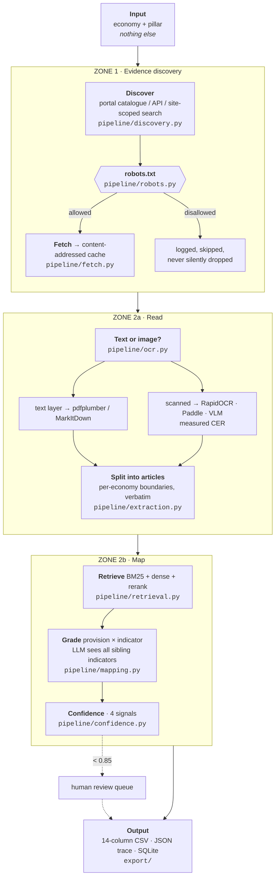
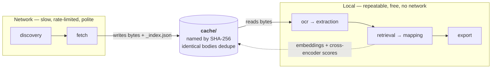
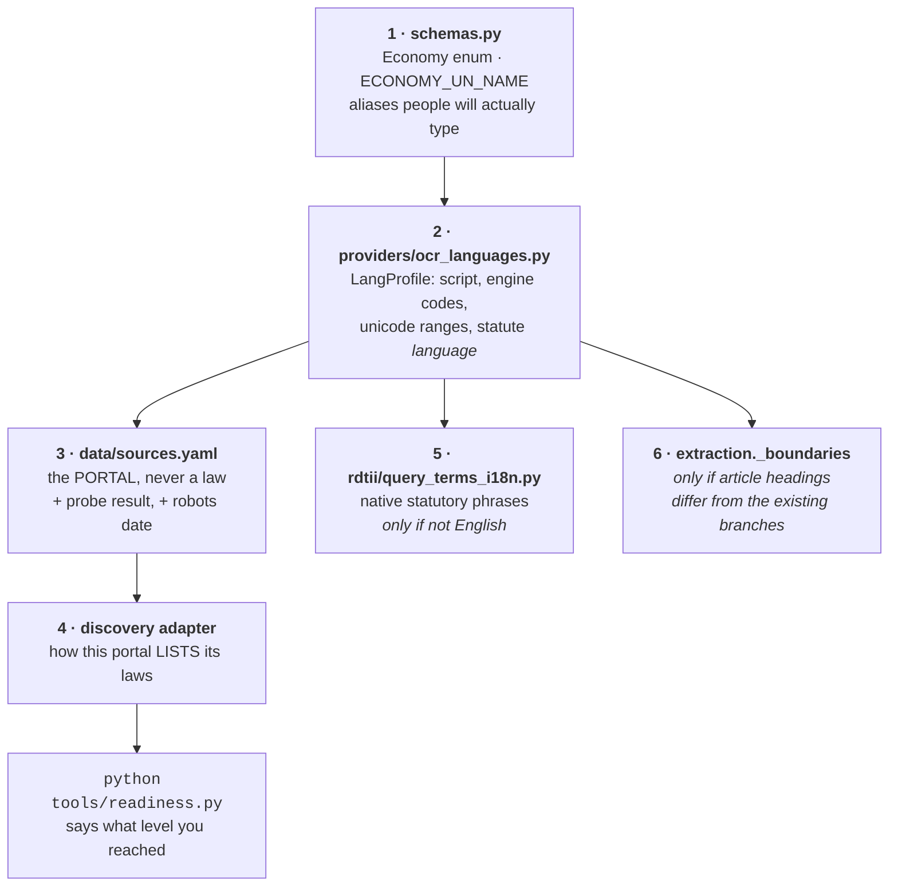
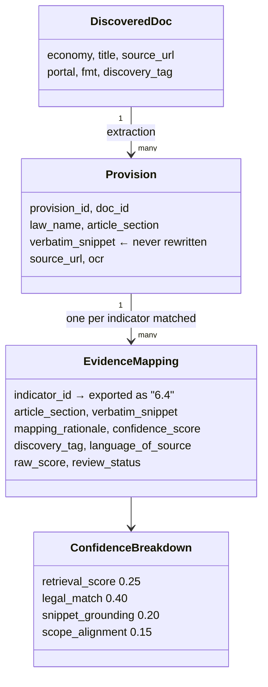
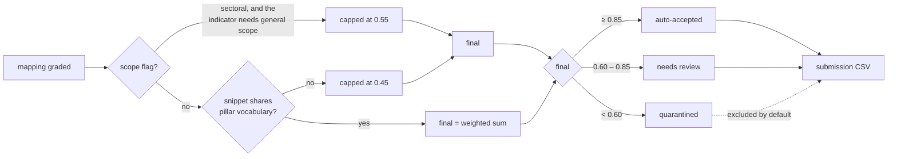

# VeriTrade — System Design

For someone who has just cloned the repository and wants to change something in it.

Every diagram below renders on GitHub. Read them in order: the first says what the system
does, the second says where the seams are, and the rest are the three seams you are most
likely to be working at.

---

## 1. The whole system, once

The tool answers one question — *given an economy and a pillar, which provisions of which laws
satisfy which RDTII indicators, and where exactly are they?* — and it must answer it without
being told where to look.

Two things in that picture are load-bearing and easy to miss.

**Discovery takes no seed URLs.** `data/sources.yaml` names a *portal*, never a law. If it
named laws, the tool would be a lookup table with a crawler bolted on, and the entire scored
premise would be gone.

**Small corpora are graded exhaustively.** Under `grade_all_max_provisions` (80) every
provision is graded against every indicator, so retrieval is a *signal*, not a gate. This is
why imperfect non-English ranking does not cost recall.

---

## 2. The seam that matters most: fetching is not reading

The final-round template asks for this boundary explicitly, because a reviewer will re-run the
tool and expect the second pass to fetch nothing. It is also the seam that makes the tool
cheap to iterate on: reading is free, fetching is not.

Consequences worth knowing before you change anything here:

- A second run over the same economy touches the network **zero times** while bodies are
  inside `FETCH_TTL_HOURS` (default 24). The run log's document list is empty; that is the
  intended proof, not a bug.
- Files are named by the SHA-256 of their *content*, so two URLs serving the same Act share one
  file, and a changed Act naturally gets a new one.
- `_index.json` maps URL → file. Delete the cache directory to force a true cold run.
- robots.txt is consulted **before the cache is read**, not only before the network. A rule
  published after we fetched a body still governs whether we may use it.

---

## 3. Adding an economy

The most common change, and the one with the most non-obvious steps. Nothing here involves
touching the pipeline.

Step 2 decides more than OCR. `LangProfile.language` feeds the **Language of Source** column,
the grading prompt, and — through `is_english_text()` — whether the cross-encoder runs at all.
Getting it wrong is silent in all three places: Kazakhstan had no entry, so it took the Latin
default and reported its Cyrillic statutes as English.

Step 4 is the real work, and there is no generic answer because no two portals agree:

| Portal | How it lists laws | Adapter |
| :--- | :--- | :--- |
| legislation.gov.au | public OData JSON API | `au_api` |
| lom.agc.gov.my | JSON catalogue, **AES-GCM encrypted** (key published in its own page) | `my_catalogue` |
| sso.agc.gov.sg | ignores `CurrentPage`; enumerate by union of sort windows | custom |
| everything else | site-scoped web search | `websearch` |

`websearch` is the fallback, not the plan. Malaysia is the cautionary tale: Google had indexed
only the homepage of `lom.agc.gov.my`, so the search lane returned **zero Acts** and said
nothing about it. Run `python tools/probe_portals.py --economy XX` before trusting it.

---

## 4. Adding an engine (LLM, OCR, reranker)

Provider-swappability is scored twice — once on the desk review and again live — so it is a
factory, not a conditional.

Two rules this layer enforces that are worth understanding before you extend it.

**The OCR factory resolves against the machine, not against the registry.** The registry says
what an engine family *supports*; the factory knows what is installed. When they disagree the
factory substitutes and records `provider.substituted_for` — it never runs an engine whose
dictionary cannot spell the script, because that produces fluent text with letters missing and
raises nothing. If no local engine can read the script, it falls back to the vision model
rather than failing the economy.

**`engine_profile` attaches a reason and an evidence grade to every choice**
(`measured` / `documented` / `assumed`). This is what the README and the Word submission
quote, so a preference nobody can justify is a preference we do not ship.

---

## 5. What a row is made of

`verbatim_snippet` is the invariant of the whole system. It is carried unchanged from
extraction to CSV — never summarised, never translated, never re-cased. The grading prompt is
written in English and requires English *output*, while the snippet itself is passed through
untouched, because the Verbatim Snippet column *is* the statute's own text and a translated
snippet is a false citation.

One provision can legitimately produce several rows: the panel's own answer key maps a single
section to more than one indicator.

---

## 6. Where a row can end up

Confidence is **relative, not a calibrated probability** — it ranks rows against each other
within a run, and the thresholds are conventions. Flagging a row low is treated by the rubric
as a strength.

Known limitation, stated because it affects reading the numbers across economies: the
`retrieval_score` component is on a different scale in the two language lanes, because the
English lane's cross-encoder pulls it down and the non-English lane has no cross-encoder. Two
equally good rows from two economies therefore carry different confidence. See
[README — Known Limitations](../README.md#known-limitations).

---

## 7. Module map

| You want to change | File |
| :--- | :--- |
| Which portals exist, and what we know about each | `data/sources.yaml` |
| How a portal is enumerated | `backend/pipeline/discovery.py` |
| Whether we may fetch a URL | `backend/pipeline/robots.py` |
| How bytes are fetched and cached | `backend/pipeline/fetch.py`, `scrapling_fetch.py` |
| Text layer vs OCR, and CER | `backend/pipeline/ocr.py`, `backend/providers/ocr_*.py` |
| Where one article ends and the next begins | `backend/pipeline/extraction.py` |
| Tokenisation, BM25, dense, rerank | `backend/pipeline/retrieval.py`, `ranking.py` |
| What each indicator legally requires | `backend/rdtii/indicators.py` |
| All 12 pillars: criteria, weights, traps | `data/rdtii/indicator_reference.json` |
| Which engine for which economy, and why | `backend/providers/engine_profile.py` |
| The grading prompt | `backend/pipeline/mapping.py` |
| Scoring 0 / 0.5 / 1 (Zone 3) | `backend/rdtii/scoring_rubric.py`, `pipeline/scoring.py` |
| NEW vs KNOWN, per provision | `backend/rdtii/baseline.py` |
| Indicator ID `P6-I4` → `6.4` | `backend/rdtii/codes.py` |
| Draft / repealed / amending detection | `backend/rdtii/instrument.py` |
| The CSV the secretariat validates | `backend/export/csv_export.py`, `backend/schemas.py` |
| The interface | `frontend/app.py`, `matrix.py`, `runview.py`, `enginebench.py` |
| End-to-end run + audit trail | `backend/pipeline/orchestrator.py` |
