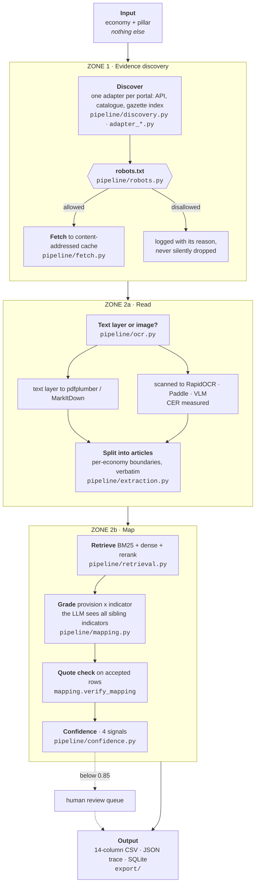
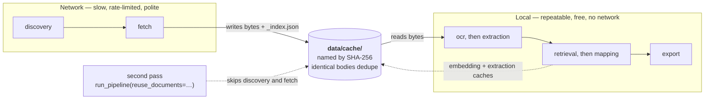
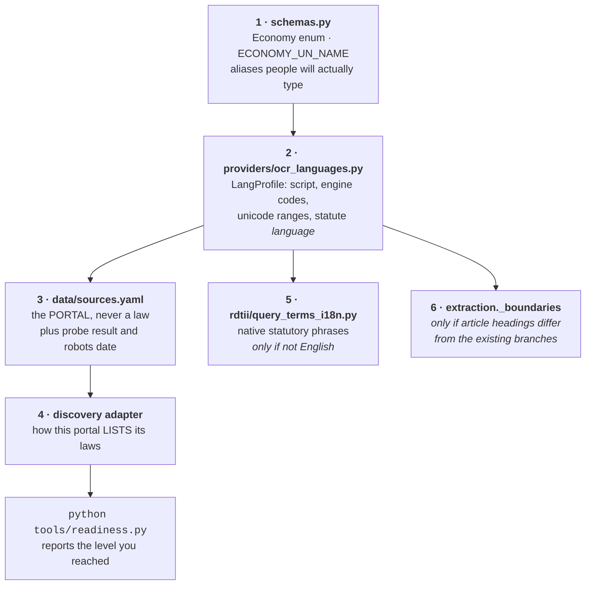
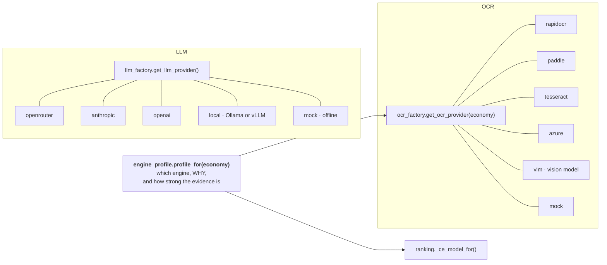
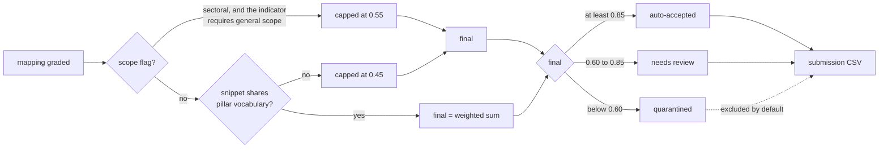

# VeriTrade — Architecture

> Auditable legal evidence extraction for UNESCAP RDTII 2.1. Twelve pillars in scope, 6 and 7
> mandatory (and the only two measured); eleven economies declared — Singapore, Australia,
> Malaysia and the panel's eight — nine of which run end to end.
> Built audit-first: every output row traces back to verbatim source text, retrieval logs, OCR
> metrics, and reviewer decisions.
>
> **Part I** orients someone who has just cloned the repository and wants to change something.
> **Part II** is the reference: schemas, formulas, and the reasoning behind specific numbers.
> **Part III** keeps the design notes and evidence that used to live in the README.
> The diagrams render on GitHub. Deployment is in [DEPLOYMENT.md](DEPLOYMENT.md).

---

# Part I — Orientation

## The whole system, once

It answers one question — *given an economy and a pillar, which provisions of which laws
satisfy which RDTII indicators, and where exactly are they?* — without being told where to look.


```mermaid
flowchart TB
    IN["<b>Input</b><br/>economy + pillar<br/><i>nothing else</i>"]

    subgraph Z1["ZONE 1 · Evidence discovery"]
        direction TB
        D["<b>Discover</b><br/>one adapter per portal: API, catalogue, gazette index<br/><code>pipeline/discovery.py</code> · <code>adapter_*.py</code>"]
        R{{"<b>robots.txt</b><br/><code>pipeline/robots.py</code>"}}
        F["<b>Fetch</b> to content-addressed cache<br/><code>pipeline/fetch.py</code>"]
        D --> R -->|allowed| F
        R -->|disallowed| SKIP["logged with its reason,<br/>never silently dropped"]
    end

    subgraph Z2A["ZONE 2a · Read"]
        direction TB
        O["<b>Text layer or image?</b><br/><code>pipeline/ocr.py</code>"]
        T["text layer to pdfplumber / MarkItDown"]
        S["scanned to RapidOCR · Paddle · VLM<br/>CER measured"]
        X["<b>Split into articles</b><br/>per-economy boundaries, verbatim<br/><code>pipeline/extraction.py</code>"]
        O --> T --> X
        O --> S --> X
    end

    subgraph Z2B["ZONE 2b · Map"]
        direction TB
        RET["<b>Retrieve</b> BM25 + dense + rerank<br/><code>pipeline/retrieval.py</code>"]
        G["<b>Grade</b> provision x indicator<br/>the LLM sees all sibling indicators<br/><code>pipeline/mapping.py</code>"]
        V["<b>Quote check</b> on accepted rows<br/><code>mapping.verify_mapping</code>"]
        C["<b>Confidence</b> · 4 signals<br/><code>pipeline/confidence.py</code>"]
        RET --> G --> V --> C
    end

    OUT["<b>Output</b><br/>14-column CSV · JSON trace · SQLite<br/><code>export/</code>"]

    IN --> Z1 --> Z2A --> Z2B --> OUT
    C -.->|"below 0.85"| REV["human review queue"]
    REV -.-> OUT
```

Two things there are load-bearing and easy to miss.

**Discovery takes no seed URLs.** `data/sources.yaml` names a *portal*, never a law. If it
named laws the tool would be a lookup table with a crawler bolted on, and the scored premise
would be gone.

**Small corpora are graded exhaustively.** At or below `grade_all_max_provisions` (80) every
provision is graded against every indicator, so retrieval is a *signal*, not a gate. This is
why imperfect non-English ranking does not cost recall.

---

## The seam that matters most: fetching is not reading

The final-round template asks for this boundary explicitly, because a reviewer re-runs the tool
and expects the second pass to fetch nothing. It is also what makes the tool cheap to iterate
on: reading is free, fetching is not.


```mermaid
flowchart LR
    subgraph NET["Network — slow, rate-limited, polite"]
        DISC["discovery"] --> FETCH["fetch"]
    end
    CACHE[("<b>data/cache/</b><br/>named by SHA-256<br/>identical bodies dedupe")]
    subgraph LOCAL["Local — repeatable, free, no network"]
        READ["ocr, then extraction"] --> MAP["retrieval, then mapping"] --> EXP["export"]
    end
    FETCH -->|"writes bytes + _index.json"| CACHE
    CACHE -->|"reads bytes"| READ
    MAP -.->|"embedding + extraction caches"| CACHE
    SP["second pass<br/>run_pipeline(reuse_documents=…)"] -.->|"skips discovery and fetch"| CACHE
```

- **The second pass** is `run_pipeline(reuse_documents=<first run's document list>)`
  (`pipeline/orchestrator.py`). It skips discovery and fetching entirely and re-reads the first
  pass's bodies from the cache, so its fetched-document count is zero. The interface drives it
  from the **Live test** screen: *Run engine B* re-reads what *Run engine A* downloaded. It never
  consults the stored-result cache, because a stored answer would read nothing.
- **Two other caches, not to be confused with it.** A body younger than `FETCH_TTL_HOURS`
  (default 24) is reused by a live run without a network request. And a *stored result*
  (`data/cache/_results/`, 30-day TTL, invalidated by any change to `backend/` or
  `sources.yaml`) answers a repeat run when the Run screen's **Search again** box is unticked;
  the screen marks such a result as saved.
- Files are named by the SHA-256 of their *content*, so two URLs serving the same Act share one
  file and a changed Act naturally gets a new one. `_index.json` maps URL to file.
- robots.txt is consulted **before the cache is read**, not only before the network: a rule
  published after we fetched a body still governs whether we may use it.

---

## Adding an economy

The most common change, and the one with the most non-obvious steps. None of it touches the
pipeline.


```mermaid
flowchart TB
    A["<b>1 · schemas.py</b><br/>Economy enum · ECONOMY_UN_NAME<br/>aliases people will actually type"]
    B["<b>2 · providers/ocr_languages.py</b><br/>LangProfile: script, engine codes,<br/>unicode ranges, statute <i>language</i>"]
    C["<b>3 · data/sources.yaml</b><br/>the PORTAL, never a law<br/>plus probe result and robots date"]
    D["<b>4 · discovery adapter</b><br/>how this portal LISTS its laws"]
    E["<b>5 · rdtii/query_terms_i18n.py</b><br/>native statutory phrases<br/><i>only if not English</i>"]
    F["<b>6 · extraction._boundaries</b><br/><i>only if article headings differ<br/>from the existing branches</i>"]
    A --> B --> C --> D
    B --> E
    B --> F
    D --> V["<code>python tools/readiness.py</code><br/>reports the level you reached"]
```

Step 2 decides more than OCR. `LangProfile.language` feeds the **Language of Source** column,
the grading prompt, and — through `is_english_text()` — whether the cross-encoder runs at all.
Getting it wrong is silent in all three places: an economy with no entry takes the Latin
default and reports its Cyrillic statutes as English (this happened to Kazakhstan, since
removed from scope).

Step 4 is the real work, and there is no generic answer because no two portals agree. The
adapter name in `sources.yaml` is resolved either by `_ADAPTERS` in `pipeline/discovery.py`
(`au_api`, `my_catalogue`, `in_dspace`, `mn_legalinfo`) or by the adapter module's own
`portal.register(...)` call (the rest):

| Economy | Portal | How it lists laws | Adapter |
| :--- | :--- | :--- | :--- |
| SG | sso.agc.gov.sg | ignores `CurrentPage`; enumerate by union of sort windows | `sg_sso` (`adapter_singapore.py`) |
| AU | www.legislation.gov.au | public OData JSON API; multi-volume compilations | `au_api` |
| MY | lom.agc.gov.my | JSON catalogue, **AES-GCM encrypted** (key published in its own page) | `my_catalogue` (`portal_crypto.py`) |
| MY | www.pdp.gov.my | WordPress REST index | `wp_regulator` |
| CN | www.cac.gov.cn, search.cac.gov.cn | section indexes + full-text search (browser lane) | `cn_portal` (`adapter_china.py`) |
| CN | www.gov.cn/gongbao | State Council Gazette issue index, texts screened for data-territory and protection duties | `cn_gazette` (`adapter_cn_gazette.py`) |
| IN | indiacode.gov.in | DSpace repository | `in_dspace` (`adapter_india.py`) |
| MN | legalinfo.mn | sitemap + full-text export | `mn_legalinfo` (`adapter_mongolia.py`) |
| TH | www.law.go.th | the portal's law API, one article per item | `th_law_api` (`adapter_thailand.py`) |
| ID | peraturan.bpk.go.id | search, behind a Cloudflare challenge | `id_bpk` (`adapter_indonesia.py`) |
| LA | laoofficialgazette.gov.la | gazette index pages | `la_gazette` (`adapter_laos.py`) |
| TL | mj.gov.tl/jornal | gazette index pages | `tl_gazette` (`adapter_timor.py`) |
| RU | pravo.gov.ru | the official IPS search, cp1251, current redaction | `ru_ips` (`adapter_russia.py`) |

Shared mechanics (robots-checked GET with backoff, document ids) are in `pipeline/portal.py`.
`websearch` remains in `sources.yaml` as a secondary lane only: every search engine tried now
answers HTTP 403 or has no credit, and it was never the plan — Google had indexed only the
homepage of `lom.agc.gov.my`, so the search lane once returned **zero Malaysian Acts** and said
nothing about it. Run `python tools/probe_portals.py --economy XX` before trusting a new portal.

---

## Adding an engine (LLM, OCR, reranker)

Provider-swappability is scored twice — desk review and again live — so it is a factory, not a
conditional.


```mermaid
flowchart LR
    subgraph LLMS["LLM"]
        LF["llm_factory.get_llm_provider()"]
        LF --- L1["openrouter"]
        LF --- L2["anthropic"]
        LF --- L3["openai"]
        LF --- L4["local · Ollama or vLLM"]
        LF --- L5["mock · offline"]
    end
    subgraph OCRS["OCR"]
        OF["ocr_factory.get_ocr_provider(economy)"]
        OF --- O1["rapidocr"]
        OF --- O2["paddle"]
        OF --- O3["tesseract"]
        OF --- O4["azure"]
        OF --- O5["vlm · vision model"]
        OF --- O6["mock"]
    end
    EP["<b>engine_profile.profile_for(economy)</b><br/>which engine, WHY,<br/>and how strong the evidence is"]
    EP --> OF
    EP --> RR["ranking._ce_model_for()"]
```

**The OCR factory resolves against the machine, not the registry.** The registry states what an
engine family *supports*; the factory knows what is installed. On disagreement it substitutes
and records `provider.substituted_for` — it never runs a recogniser whose dictionary cannot
spell the script, because that yields fluent text with letters missing and raises nothing. If
no local engine can read the script it falls back to the vision model rather than failing the
economy.

**Every choice carries a reason and an evidence grade** (`measured` / `documented` / `assumed`).
The README and the Word submission quote those strings, so a preference nobody can justify is a
preference we do not ship. Print it with `python -m backend.providers.engine_profile`.

---

## Where a row can end up


```mermaid
flowchart LR
    M["mapping graded"] --> S{"scope flag?"}
    S -->|"sectoral, and the indicator<br/>requires general scope"| CAP["capped at 0.55"]
    S -->|no| TC{"snippet shares<br/>pillar vocabulary?"}
    TC -->|no| CAP2["capped at 0.45"]
    TC -->|yes| N["final = weighted sum"]
    CAP --> N2["final"]
    CAP2 --> N2
    N --> R{"final"}
    N2 --> R
    R -->|"at least 0.85"| A["auto-accepted"]
    R -->|"0.60 to 0.85"| P["needs review"]
    R -->|"below 0.60"| Q["quarantined"]
    A --> CSV["submission CSV"]
    P --> CSV
    Q -.->|excluded by default| CSV
```

The numbers are explained in **Part II section 9**, including why 0.40 and why 0.60.

---

## Module map

| You want to change | File |
| :--- | :--- |
| Which portals exist, and what we know about each | `data/sources.yaml` |
| How a portal is enumerated | `backend/pipeline/discovery.py`, `backend/pipeline/adapter_*.py`, `portal.py` |
| Whether we may fetch a URL | `backend/pipeline/robots.py` |
| How bytes are fetched and cached | `backend/pipeline/fetch.py`, `scrapling_fetch.py` |
| Text layer vs OCR, and CER | `backend/pipeline/ocr.py`, `backend/providers/ocr_*.py` |
| Where one article ends and the next begins | `backend/pipeline/extraction.py` |
| Tokenisation, BM25, dense, rerank | `backend/pipeline/retrieval.py`, `ranking.py` |
| What each indicator legally requires | `backend/rdtii/indicators.py` |
| All 12 pillars: criteria, weights, traps | `data/rdtii/indicator_reference.json` |
| Which engine for which economy, and why | `backend/providers/engine_profile.py` |
| The grading prompt | `backend/pipeline/mapping.py` |
| Scoring 0 / 0.5 / 1 (Zone 3) | `backend/rdtii/scoring_rubric.py`, `pipeline/scoring.py` |
| NEW vs KNOWN, per provision | `backend/rdtii/baseline.py` |
| Indicator ID `P6-I4` to `6.4` | `backend/rdtii/codes.py` |
| Draft / repealed / amending detection | `backend/rdtii/instrument.py` |
| The CSV the secretariat validates | `backend/export/csv_export.py`, `backend/schemas.py` |
| The interface | `frontend/app.py`, `home.py` (Run screen), `livetest.py`, `enginebench.py`, `matrix.py`, `runview.py` |
| End-to-end run, second pass, result cache, audit trail | `backend/pipeline/orchestrator.py` |
| Cost per run and per engine | `backend/metering.py`, `data/pricing.json` |
| Review decisions (approve / reject / correct) | `backend/review/workflow.py` |

---

# Part II — Reference

## 1. System architecture

Three zones over one audit store. Each stage is a pure-ish function persisted to
SQLite, so any export is reconstructable from the database.

```
                         ┌──────────────────────── ZONE 1 · DISCOVERY & FETCH ─────────────────┐
  official portals ─────▶│ one adapter per portal (samples offline | live httpx/Scrapling)     │
  (11 economies)         │ robots.txt · per-host delay · content-addressed cache (data/cache)  │
                         └──────────────────────────────┬─────────────────────────────────────┘
                                                        │ DiscoveredDoc[]  (second pass enters here)
                         ┌──────────────────────── ZONE 2 · EXTRACTION & MAPPING ──────────────┐
                         │ text acquisition:  HTML strip │ PDF text layer │ scanned→OCR         │
                         │ OCR provider (pluggable): rapidocr | paddle | tesseract | vlm | azure│
                         │ provision extraction: per-economy article split, VERBATIM snippets   │
                         │ retrieval: script-aware BM25 + dense + cross-encoder                 │
                         │ mapping: LLM grades vs legal test + siblings; quote check; KNOWN/NEW │
                         │ confidence: 4-signal weighted score → route                          │
                         └──────────────────────────────┬─────────────────────────────────────┘
                                                        │ EvidenceMapping[]
        ┌────────── confidence router ──────────┐       │
        │ ≥0.85 auto · 0.60–0.84 review · <0.60 │◀──────┘
        │ quarantine  (scope flag caps at 0.55) │
        └───────────────┬───────────────────────┘
                        ▼
   HITL review (approve/reject/correct) ──▶ CSV (reviewers) · JSON (technical) · SQLite audit log
```

**Shared services**
- `config.py` — env-driven settings, safe defaults, no provider hardcoded.
- `storage/db.py` — SQLite audit store: runs, documents, provisions, mappings, review_log.
- `providers/` — interchangeable OCR + LLM behind small interfaces (factory pattern).

**Design principles**
1. *Grounding before generation.* The LLM only ever sees retrieved verbatim
   snippets and is forbidden from asserting law it wasn't given. Law text, article
   numbers, and URLs are **carried from extraction, never generated**.
2. *Every score is explainable.* Confidence is a transparent weighted blend stored
   on the mapping (`confidence_breakdown`).
3. *Scope safety.* A national-scope indicator can't be satisfied by a sectoral
   instrument — the mapper flags `SECTORAL_NOT_NATIONAL` and the score is capped.
4. *Offline-first demo.* `mock` providers make the whole pipeline reproducible with
   no keys/network; real providers activate when configured.

---

## 2. Folder structure

```
law-v2.0/
├── README.md  INSTALL.md  LICENSE  Dockerfile  requirements.txt  .env.example
├── main.py  run.py  batch_run.py     command-line entry points (the interface needs none)
├── backend/
│   ├── config.py                 Settings (pydantic-settings), incl. the two declared engines
│   ├── schemas.py                pydantic models, SUBMISSION_COLUMNS, economy lists
│   ├── metering.py               cost per run and per engine, counted as spent
│   ├── main.py  cli.py           FastAPI surface and Typer CLI
│   ├── rdtii/                    indicators.py (P6/P7, measured) · indicators_wide.py (other 10
│   │                             pillars, declared) · codes · baseline (NEW/KNOWN) · scoring_rubric
│   ├── providers/                llm_{openrouter,anthropic,openai,gemini,local}.py · llm_factory.py
│   │                             ocr_{rapidocr,paddle,tesseract,markitdown,vlm,azure}.py · ocr_factory.py
│   │                             ocr_languages.py (per-economy language profile) · engine_profile.py
│   ├── pipeline/
│   │   ├── discovery.py  adapter_*.py  portal.py     Zone 1: one lane per portal
│   │   ├── robots.py  fetch.py  scrapling_fetch.py   polite download to data/cache/
│   │   ├── ocr.py  extraction.py                     Zone 2a: read, split into articles
│   │   ├── retrieval.py  ranking.py  retrieval_budget.py
│   │   ├── mapping.py  confidence.py  scoring.py  translate.py
│   │   └── orchestrator.py                           end-to-end run + second pass
│   ├── review/workflow.py        approve / reject / correct + audit log
│   ├── storage/                  SQLAlchemy engine; SQLite by default, Postgres via DATABASE_URL
│   ├── export/                   csv_export · json_export · scored_export
│   ├── eval/  corpus/            evaluation against the panel's database (never used by a live run)
│   └── auth/                     accounts and sessions
├── frontend/                     Streamlit: app.py · home.py · livetest.py · enginebench.py
│                                 matrix.py · runview.py · theme.py
├── data/
│   ├── sources.yaml              portals (never laws), adapters, probe notes
│   ├── samples/                  offline corpus for a keyless run
│   ├── pricing.json              per-token prices used by metering
│   └── cache/                    downloaded bodies + _index.json (created at run time)
├── tools/                        readiness, portal probes, retrieval sweeps, answer-key comparison
├── tests/                        pytest suite + saved portal fixtures
├── deploy/  .github/workflows/   hosted deploy, CI, desktop installers
└── outputs/                      CSV/JSON exports and veritrade.db (created at run time)
```

---

## 3. Data schemas (pydantic — `backend/schemas.py`)

| Model | Role |
|---|---|
| `Indicator` | RDTII target: `indicator_id, pillar, title, legal_test, scope, query_terms` |
| `DiscoveredDoc` | Zone 1 output: `title, source_url, fmt, relevance_score, discovery_tag, amendment_date` |
| `Provision` | Extracted clause: `law_name, article_section, verbatim_snippet, source_url, char_span, ocr` |
| `OCRMetrics` | `used, provider, mean_confidence, pages, chars, low_conf_pages` |
| `ConfidenceBreakdown` | `retrieval_score, legal_match, snippet_grounding, scope_alignment, final, explanation` |
| `EvidenceMapping` | **The auditable record** (see CSV/JSON below) |
| `RunMeta` / `RunResult` | run envelope: timings, counts, provider versions |

---

## 4. CSV schema — OFFICIAL submission template (policy judge)

`outputs/veritrade_<run_id>.csv` (interface) or `outputs/<ECON>_P<pillars>_<timestamp>.csv`
(command line) matches the UNESCAP RDTII submission template **exactly**
(column names + order — judges validate programmatically). One row per
provision×indicator, **verbatim wording preserved**, `utf-8-sig` for Excel. By default
only submittable rows are written (rejected/quarantined excluded, so a sectoral mis-map
never enters a national-indicator submission); pass `submission_only=False` to dump all.

| # | Column (exact) | Req. | Source in pipeline |
|---|---|---|---|
| 1 | `Economy` | ✓ | official UN member-state name (SG→Singapore, …) |
| 2 | `Law Name` | ✓ | statute title + year |
| 3 | `Law Number / Ref` | opt | from manifest/discovery (e.g. `Act 709`) |
| 4 | `Last Amended` | ✓ | **year** of `amendment_date` |
| 5 | `Indicator ID` | ✓ | RDTII 2.1 code **as text**: `6.1`, `7.3`, `12.9`. Converted from the internal `P6-I1` at the export boundary by `rdtii/codes.py` — never a float, because `12.10` would collapse to `12.1` |
| 6 | `Article / Section` | ✓ | extracted clause label |
| 7 | `Discovery Tag` | ✓ | `KNOWN` / `NEW`, decided **per provision** against the panel's 2025 baseline — law name AND article (`rdtii/baseline.py`), not law name alone |
| 8 | `Location Reference` | opt | `p. N` (PDF/OCR) or `#sec26` anchor (HTML) |
| 9 | `Verbatim Snippet` | ✓ | exact statutory wording (never paraphrased) |
| 10 | `Mapping Rationale` | opt | templated "This [§] [verb] [what]. Maps to [id] because …" (≤300 chars) |
| 11 | `Source URL` | ✓ | official portal URL |
| 12 | `Confidence` | opt | 2-dp 0.00–1.00 |
| 13 | `Notes` | opt | OCR/scope/bilingual flags, plus a warning when the instrument is a draft, a repeal or an amending act (`rdtii/instrument.py`) |
| 14 | `Language of Source` | ✓ | the document's ORIGINAL language, read from the same registry the OCR and reranker decisions use (`providers/ocr_languages.py`). Drives C1c |

> **Before submitting:** indicator IDs/titles/questions are the official RDTII 2.1
> reference; the `legal_test`/`query_terms` are our interpretation. Closely-related
> indicators (e.g. the cross-border exceptions P6-I2..P6-I5, or P7-I1 vs P7-I2)
> are easy to confuse — review mappings, especially `pending_review` rows. NEW
> provisions score highest, so check the `NEW`-tagged rows carefully.

See [examples/example_SG.csv](examples/example_SG.csv). `review_status` and all technical
metadata live in the JSON (§5), not the submission CSV.

---

## 5. JSON schema (technical reviewers)

`outputs/veritrade_<run_id>.json` (or `<ECON>_P<pillars>_<timestamp>.json`) — adds
everything the CSV omits, including the run's cost table under `run.cost`:

```jsonc
{
  "run": { "run_id", "economy", "pillars", "processing_time_seconds",
           "docs_discovered", "provisions_extracted", "mappings_produced", ... },
  "provider_versions": { "ocr_provider", "llm_provider", "model_version" },
  "summary": { "total", "by_status": { ... } },
  "mappings": [{
     "...all CSV fields...",
     "confidence_breakdown": { "retrieval_score","legal_match","snippet_grounding",
                               "scope_alignment","final","explanation" },
     "scope_flag": "SECTORAL_NOT_NATIONAL | null",
     "raw_context": "the retrieval window the model actually saw",
     "ocr_metrics": { "used","provider","mean_confidence","pages","low_conf_pages" },
     "model_version": "...",
     "retrieval_log": ["indicator=... query=...", "bm25_raw=... normalised=..."],
     "human_note": "reviewer note | null"
  }]
}
```

See [examples/example_SG.json](examples/example_SG.json).

---

## 6. OCR / extraction pipeline (`pipeline/ocr.py` + `providers/ocr_*`)

```
DiscoveredDoc.fmt ──► html         → lxml / BeautifulSoup strip → text
                  ──► pdf_text     → pdfplumber text layer (never reaches OCR)
                  ──► pdf_scanned  → OCR provider .ocr_pdf() → text (+ confidence, CER)
                                    • rapidocr (DEFAULT), paddle, tesseract, vlm, azure
                                    • a secretly-scanned PDF (thin or mojibake text layer)
                                      is detected and routed to OCR
```

- **Default engine = RapidOCR** (`OCR_PROVIDER=rapidocr`): real raster OCR, pip-only,
  Apache-2.0; the engine the bundled CER 1.11 % was measured with. Text-layer PDFs are read with
  pdfplumber first, so OCR only ever sees pages without a usable text layer.
- **Interchangeable** via `OCR_PROVIDER` (`rapidocr|paddle|tesseract|markitdown|vlm|azure|mock`)
  — selected by `ocr_factory.get_ocr_provider(economy=…)`, or chosen on the **Engines** screen.
  The recognition model is chosen per economy from `providers/ocr_languages.py`; if the
  installed engine cannot spell the script, the factory substitutes rather than running it.
  Heavy imports are deferred; unused providers need not be installed.
- **Quality captured**: provider, `mean_confidence` (None for deterministic extraction),
  per-page confidence, `low_conf_pages` → `OCRMetrics` → every mapping (JSON `ocr_quality`).
- **Offline robustness**: the bundled sample corpus (`data/samples/`) includes a scanned PDF
  (`SG/mas_notice_655.pdf`) so the OCR path and its CER measurement run without a network.

---

## 7. Retrieval pipeline (`pipeline/retrieval.py`)

- Builds a query per indicator from `title + description + legal_test + query_terms`
  (the `legal_test`'s "Distinguish from …" notes give BM25 the vocabulary to tell
  confusable siblings apart, e.g. "consent" for P6-I4 vs "retention" for P7-I3).
- **Hybrid**: BM25 (`rank_bm25`, pure-Python fallback if absent) blended with
  multilingual dense embeddings (`paraphrase-multilingual-MiniLM-L12-v2`) —
  `combined = alpha·bm25_norm + (1-alpha)·dense_cosine` (`HYBRID_ALPHA`, default **0.65**,
  measured — see [retrieval-redesign.md](retrieval-redesign.md))
  — then re-ranked against a cross-encoder (`cross-encoder/ms-marco-MiniLM-L-6-v2`) read jointly
  over (indicator, provision). For non-English economies the English cross-encoder is never used:
  the multilingual one (`BAAI/bge-reranker-v2-m3`) runs only when
  `CROSS_ENCODER_MULTILINGUAL_ENABLED=true` (off by default — too slow on CPU); otherwise the
  reranker is off. Tokenisation is script-aware: Han, Thai, Lao and similar scripts are indexed
  as character bigrams. A phrase-presence bonus and a
  sibling-phrase penalty run before the rerank to pre-empt the most commonly
  confused pairs (P6-I1↔P6-I4, P7-I1↔P7-I2). Every stage is individually
  disable-able (`DENSE_RETRIEVAL`, `CROSS_ENCODER`) and the pipeline degrades to
  BM25-only if the heavier libs aren't installed — never a hard failure.
- Final `retrieval_score` (0–1, the confidence-scoring input) is this blended,
  reranked, clipped-≥0 value; `retrieval_log` records the BM25/dense/alpha/bonus/
  penalty breakdown per candidate so a reviewer can see exactly why it ranked there.
- A **semantic-recall guarantee** re-admits the top pure-dense matches the reranked
  cut dropped (`dense_recall_floor`) — the cross-encoder is general-domain/English
  and can bury a provision phrased in unusual words ("must not hold records outside
  the country" with no literal "transfer"); recall is intentionally biased high here
  because the LLM grader downstream is the precision stage, not this one.
- The mapper only sees provisions surfaced here → mappings stay citation-bound.
- **LightRAG** (`RETRIEVER=lightrag|auto`) is a drop-in graph-RAG alternative at
  live-crawl scale; it degrades to this hybrid retriever on any failure.

---

## 8. Mapping logic (`pipeline/mapping.py`)

For each (indicator, retrieved provision):

1. Build a structured prompt carrying the indicator's **legal test**, scope, query
   terms, **every sibling indicator in the pillar**, and the **verbatim snippet** only.
2. The LLM returns `{relevant, best_fit_indicator, legal_match, scope_alignment,
   scope_flag, rationale}` — judging *only the snippet*, distinguishing **legal**
   relevance (the operative rule satisfies the test) from **semantic** relevance (same
   topic), and naming the best-fitting sibling so close indicators aren't conflated.
3. **Disambiguation**: if a sibling fits better (`best_fit_indicator ≠ target`), the
   pairing is dropped — the provision is mapped under the better sibling on its own pass.
4. Sectoral language against a national indicator ⇒ `scope_flag=SECTORAL_NOT_NATIONAL`
   and a capped score. *(Example: the sectoral MAS Notice 655 in the bundled sample.)*
5. **Quote check** (`mapping.verify_mapping`, `VERIFY_MODEL`): every accepted row outside 7.1
   is re-read by a second model that must quote, word for word, the snippet's words for each
   element of the legal test; the code confirms each quote is in the statute. An element it
   cannot quote quarantines the row; a quote the code cannot find sends it to review. The
   Mapping Rationale is then written from the verified quotes.
6. Law name, article number, URL, OCR metrics come from extraction — **not** the LLM.

Non-English provisions are passed to the model unchanged, with the source language named and an
instruction to answer in English; the snippet is never translated. The deterministic `mock`
grader uses transparent lexical signals so the logic is reproducible offline, and is not
evidence.

---

## 9. Confidence scoring: what it means and why these numbers

Implemented in `pipeline/confidence.py`. This section exists because "why 0.40,
why 0.85" is the single most-asked question
about the pipeline. Short answer: the weights are a **declared design ordering**
(what should dominate the routing decision), not a statistically fitted/calibrated
model — the README already says as much ("relative signals, not calibrated
probabilities"). What follows is the reasoning behind that ordering, made concrete
with worked numbers so the claim is checkable, not just asserted.

```
final = 0.25·retrieval_score        how strongly retrieved for the indicator
      + 0.40·legal_match            model judgement vs the legal test
      + 0.20·snippet_grounding      is the cited snippet actually in the source text
      + 0.15·scope_alignment        national vs sectoral fit
   capped at 0.55 if scope_flag set   (SCOPE_FLAG_CAP — sectoral vs a national-only indicator)
   capped at 0.45 if off-topic snippet (TOPICAL_FAIL_CAP — no pillar concept vocabulary at all)
```

### 9.1 What each signal actually measures, and its real numeric range

| Signal | Weight | Computed by | Typical range in practice |
|---|---|---|---|
| `retrieval_score` | 0.25 | hybrid BM25+dense+cross-encoder rerank (§7) — an information-retrieval heuristic, not a legal judgement | spread across 0–1; the *strength of topical match*, independent of whether the LLM ultimately agrees |
| `legal_match` | 0.40 | the LLM's own 0–1 self-rating against **fixed rubric anchors** stated in the grading prompt: `1.0` = rule *is* exactly the legal test, `0.7` = satisfies with a minor wording gap, `0.5` = one element of a multi-part test, `≤0.3` = mention only (and at that anchor the model is instructed to also set `satisfies_target=false`, which drops the row before scoring even runs — see 9.3) | effectively `{1.0, 0.7, 0.5}` for rows that reach scoring |
| `snippet_grounding` | 0.20 | exact-substring check of the snippet against the document's full extracted text, else token-overlap fraction | **≈1.0 for nearly every row, by construction** — see 9.2 |
| `scope_alignment` | 0.15 | the LLM's judgement of national-vs-sectoral fit, only meaningful for the one scope-sensitive indicator (`SCOPE_SENSITIVE_INDICATORS = {P7-I1}`) | ≈1.0 unless sectoral-on-P7-I1, in which case the **hard cap** (not this weight) does the real work |

### 9.2 Why `legal_match` gets the largest weight (0.40), and why the other three don't compete with it the way the raw numbers suggest

The four weights aren't really "four equally-live dials" — two of them (`snippet_grounding`,
`scope_alignment`) are **near-constant safety nets**, not day-to-day discriminators:

- `snippet_grounding` compares the verbatim snippet to the source text it was
  **sliced from at extraction time** (`extraction.py` always slices, never generates,
  the snippet). By construction that slice is a substring of the source, so
  grounding resolves to `1.0` in the overwhelming majority of rows. Its job is to
  catch a *future* regression — a provider path that lets the model paraphrase or
  quote from memory instead of only ever handling extraction-sliced text — and OCR
  boundary edge cases, not to differentiate good rows from bad ones today. It still
  carries a real weight (0.20) because when it *does* drop (a genuine hallucination
  or extraction-boundary bug), that is exactly the kind of error the rubric's
  "Citation fidelity" criterion penalises hardest — so grounding failing must move
  the needle a lot, even though it rarely fires.
- `scope_alignment` is only evaluated meaningfully for `P7-I1` (the one indicator
  whose legal test *requires* general/comprehensive scope — see
  `SCOPE_SENSITIVE_INDICATORS`); for every other indicator a sectoral law is a
  legitimate answer and the signal stays high by design. Its real enforcement is
  the **hard cap**, not the weighted term (9.4) — the 0.15 weight is a soft nudge
  for borderline cases, deliberately smaller than `legal_match` because the cap is
  what actually stops a scope-mismatched row from ever auto-accepting.

That leaves `legal_match` (0.40) and `retrieval_score` (0.25) as the two signals
that genuinely vary and drive the outcome:

- `legal_match` is the model's answer to the actual question the whole pipeline
  exists to answer — *does this provision satisfy this RDTII indicator's legal
  test* — so it is weighted to dominate. It sits below 1.0 (not the whole score)
  because a legally-plausible reading that was **never actually retrieved on-topic**
  (low `retrieval_score`) or that **cites text not really in the source**
  (low `snippet_grounding`) is still a row a human should see before it ships.
- `retrieval_score` is the largest of the remaining weight because it is
  *independent, corroborating evidence*: a provision that both an IR ranker and an
  LLM independently converge on is much more trustworthy than one only the LLM
  likes — this is the standard "two independent signals agreeing" argument for
  weighting a corroborating heuristic below the primary judgement but above a
  safety-net check.

### 9.3 A row's `legal_match` is already pre-filtered before it reaches this formula

`mapping.py` only calls `confidence.score()` for rows where `relevant = satisfies_target
AND better_sibling is null`. The rubric instructs `satisfies_target=false` once
`legal_match≤0.3` ("mention only"), so those rows are **dropped upstream** and never
reach the weighted formula at all — what actually reaches scoring has `legal_match
∈ {1.0, 0.7, 0.5}` in practice. The routing thresholds below were chosen with that
in mind.

### 9.4 Worked examples — where 0.85 and 0.60 actually land

Assume the near-constant case (`grounding=1.0`, `scope_alignment=1.0`, no caps
triggered — the common case per 9.2) and vary `legal_match` across its real
anchors and `retrieval_score` across its range:

| `legal_match` | `retrieval_score` needed to just reach 0.85 (auto-accept) | Max reachable `final` at `retrieval_score=1.0` | Route |
|---|---|---|---|
| 1.0 ("rule *is* the test") | ≥ 0.40 — a **modest** retrieval rank is enough | 1.00 | auto-accept once retrieval clears a low bar |
| 0.7 ("minor wording gap") | ≥ 0.88 — needs **near-top** retrieval rank | 0.88 | auto-accept only with strong corroboration; otherwise review |
| 0.5 ("one element of a multi-part test") | **unreachable** — max is 0.80 | 0.80 | **always** review, **never** auto-accept, by construction |

Reading this the other way round: a "textbook" legal match (1.0) only needs modest
retrieval support to auto-accept, because 0.40 + 0.20 + 0.15 = 0.75 is already
banked before retrieval is even added. A "good but imperfect" match (0.7) needs the
provision to be genuinely one of the best-retrieved candidates, not just *a*
candidate, before the system will accept it unsupervised. A "partial" match (0.5)
is **mathematically incapable of reaching 0.85** no matter how well it retrieves —
every `legal_match=0.5` row is guaranteed a human look. That guarantee is a design
property, not a coincidence: it follows directly from `0.40·0.5 + 0.20 + 0.15 = 0.55`,
leaving at most `0.25` more from a perfect retrieval score, capping the sum at `0.80`.

### 9.5 Why the quarantine floor is 0.60, not some other number

`SCOPE_FLAG_CAP = 0.55` and `TOPICAL_FAIL_CAP = 0.45` are both **below** the 0.60
review floor. Since a cap is applied as `final = min(weighted_sum, cap)`, this is
not incidental — it guarantees that any row failing either hard check (a sectoral
instrument mapped to the one indicator that requires general scope, or a snippet
sharing no vocabulary at all with the pillar's legal subject — the fabricated-mapping
guard) is **mechanically forced into quarantine**, never merely "needs review",
regardless of how strong its other three signals look. 0.60 was chosen specifically
to sit above both ceilings so this holds unconditionally; a lower floor (say, 0.50)
would let a scope-capped row (0.55) slip into the review band instead of being
quarantined, which is the wrong default for a hard legal-scope violation.

Below 0.60 and outside those two caps, a row simply never accumulated enough signal
to be worth grading a human's time on the first pass — it stays in the audit trail
(JSON/SQLite) but is excluded from the default submission set
(`SUBMITTABLE_STATUSES`), consistent with "wrong or unclear citation = point
deduction" (Overview, Citation Fidelity slide): the system is deliberately biased
toward under-claiming rather than risking a bad auto-accept.

### 9.6 Confidence vs. the Zone-3 RDTII Raw Score — two different axes, easy to conflate

The dashboard shows two 0–1-ish numbers next to each mapping and they answer
**different questions**:

- **Confidence** (this section) — *how much should you trust this citation/mapping?*
  A property of the pipeline's own certainty about its work.
- **RDTII Raw Score** (`backend/rdtii/scoring_rubric.py`, Zone 3, optional/opt-in) —
  *how restrictive/high-compliance-cost is the LAW ITSELF*, on the methodology's
  0/0.5/1 scale. A property of the legal text, judged independently of how sure the
  tool is that it found the right provision.

A mapping can be **high confidence** (the tool is certain it found the right
provision) and score **0 or 1** on Raw Score (that provision can be either very
restrictive or not restrictive at all — confidence says nothing about which). They
are deliberately styled differently in the UI (the confidence bar uses the
green/amber/red verdict palette; the Raw Score is an ink-toned "stamp") precisely
so they are never mistaken for the same measurement.

---

## 10. Human-in-the-loop (`review/workflow.py`)

| `final` | route | reviewer action |
|---|---|---|
| ≥ 0.85 | `auto_accepted` | spot-check |
| 0.60–0.84 | `pending_review` | **approve / reject / correct** |
| < 0.60 | `quarantined` | re-open if needed |

Thresholds configurable (`CONF_AUTO_ACCEPT`, `CONF_REVIEW_FLOOR`) — see §9 for why
0.85/0.60 specifically, with worked numeric examples. Every action writes an
immutable `review_log` row with reviewer, note, timestamp, and before/after JSON —
the human decision trail is itself auditable. `correct()` accepts any mapping field; the
interface exposes it as **Fix indicator** on the *Needs review* tab.

---

## 11. Extensibility

- **New economy** → the six steps under *Adding an economy* (Part I).
- **New indicator** → pillars 6 and 7 in `rdtii/indicators.py` (measured, frozen against the
  retrieval sweeps); the other ten pillars in `rdtii/indicators_wide.py` (declared).
- **New LLM or OCR engine** → *Adding an engine* (Part I); one class and one factory branch.
- **Scale-out storage** → set `DATABASE_URL` to Postgres ([AUTH_AND_DATABASE.md](AUTH_AND_DATABASE.md)).

---

# Part III — Design notes and evidence

Material moved out of the README so the README can stay a handover document. Numbers here
carry the date and place they were measured.

## III.1 Engine choice and the evidence for it

The two declared engines are set in `backend/config.py` (`declared_engine_a_*`,
`declared_engine_b_*`): **A = `deepseek/deepseek-v4-flash`** (open weights, the production
grader) and **B = `google/gemini-3.7-flash`** (closed, hosted), both through OpenRouter.

Both were measured on a bench of **28 real rows** read by hand — 16 of the panel's own answers
and 12 rows known to be wrong (2026-09-26):

| Model | Weights | Bench (28 real rows) |
| :--- | :--- | ---: |
| `deepseek/deepseek-v4-flash`, reasoning **off** | open | **28/28** |
| `deepseek/deepseek-v4-flash`, reasoning on | open | 19–20/28, up to 198 s a call |
| `google/gemini-3.7-flash` | closed | **28/28** |

Engine B was chosen for legal reading from outside our own bench: 87.26 % on Vals AI
LegalBench, 4th of 147 models (22 September 2026), the cheapest model in that top ten. Reasoning
cannot be switched off for it: a model that refuses `OPENROUTER_REASONING=off` is remembered in
`llm_openrouter._REASONING_MANDATORY` and retried with its own default.

**Per-token prices — two sources disagree.** The config comment and the former README quote
$0.047 / $0.094 per million tokens (A) and $0.75 / $3.75 (B); `data/pricing.json`, which the
metering code bills from, holds $0.07266 / $0.14532 (A) and $0.375 / $1.875 (B). Run
`python tools/refresh_prices.py` to refresh the file from the providers before quoting either.

**The quote check uses a third model**, `deepseek/deepseek-v4-pro-0813`. On 42 labelled real
rows, run twice, it kept **48/48** right rows and refused **31/36** wrong ones; the flash model in
the same role refused only 20/36 (it accepted "di luar wilayah Indonesia" — *outside*
Indonesia — as proof of in-country storage). 7.1 is exempt because the legal expert asked for
every provision of a comprehensive framework to be listed.

<details>
<summary>Superseded: the 58-case bake-off</summary>

Measured with `python tools/bakeoff.py` over `data/benchmarks/grader_bakeoff.json` — 58 cases
whose 16 positives are the panel's own answer key joined to extracted provision text. It
provisionally declared `openai/gpt-4o-mini` and `mistralai/mistral-small-3.2-24b-instruct`.

| Model | | F1 | precision | recall | $/1k calls | s/call |
| :--- | :--- | ---: | ---: | ---: | ---: | ---: |
| `mistral-small-3.2-24b` | open | **0.903** | 0.933 | 0.875 | 0.304 | 2.8 |
| `gpt-4o-mini` | hosted | 0.812 | 0.812 | 0.812 | 0.591 | 2.2 |
| `gpt-oss-120b` | open | 0.800 | 0.857 | 0.750 | 0.256 | 20.0 |
| `deepseek-v4-flash` | open | 0.786 | 0.917 | 0.688 | 0.303 | 11.5 |

It measured deepseek-v4-flash with reasoning left **on**, which is what made it slow and lossy.
Two measurement traps are recorded in `tools/build_bakeoff_set.py`: an unverified benchmark
scored every model 0.50–0.61 and ranked them differently, and a provider-side 429 storm scored
the eventual winner 0.316.
</details>

## III.2 Reading the OCR benchmarks

Two public benchmarks were read before choosing OCR engines.
[olmOCR-bench](https://huggingface.co/datasets/allenai/olmOCR-bench) is English-only (reading
order, tables, header/footer exclusion), so it bears on extraction quality and not on the hard
scripts. [MDPBench](https://huggingface.co/datasets/Delores-Lin/MDPBench) covers 17 languages:

| | overall | th | ru | id | zh | |
| :--- | ---: | ---: | ---: | ---: | ---: | :--- |
| Gemini-3-pro | **86.4** | 85.5 | 90.4 | 91.5 | 84.9 | proprietary · opt-in escalation |
| MonkeyOCRv2-S | 82.5 | **88.7** | 87.1 | 85.4 | 78.0 | open, self-host only |
| Qwen3-VL-8B | 68.3 | 61.9 | 58.4 | 68.5 | 57.9 | open and reachable · default VLM |
| PP-StructureV3 | 45.4 | 15.4 | 7.7 | 69.6 | 7.5 | Paddle's *pipeline*, not its recogniser |

Purpose-built parsers beat general vision models, and none of them is served by a hosted router,
so the hosted fallback has to be a general VLM; Qwen3-VL-8B is the best-evidenced one reachable,
with Apache-2.0 weights. **Neither benchmark covers Lao or Mongolian.** PP-StructureV3's
collapse on Thai and Cyrillic scores Paddle's document pipeline on photographed pages, not the
per-script recogniser we call on rendered government PDFs — a warning, not a verdict, which is
why those paths stay unvalidated until measured here. Per-language detail:
[OCR_LANGUAGE_EVIDENCE.md](OCR_LANGUAGE_EVIDENCE.md).

## III.3 Cost metering

`backend/metering.py` counts every billable unit as it is spent — token counts from each API
response, OCR pages per engine, search queries, bytes fetched — and every run writes the table
into its JSON under `run.cost`. `total_is_complete` is `false` whenever a component has no
price on file, and the total is then a floor, shown as *unpriced* rather than $0.00.
Two things hand arithmetic had wrong and metering found at once: the cross-check lane (a second
model on borderline rejections) was missing from the bill, and prompt tokens far exceed the
prompt's apparent size because the sibling-indicator context travels with every call. Paid OCR
would change the shape of the bill — at list price a 50-page Act costs more in OCR than a whole
mapping run in tokens — which is why local OCR is the default (`tests/test_metering.py`).

## III.4 Interface notes

- The globe on the Run screen is a WebGL earth (three.js from a CDN) with each economy's border
  coloured by readiness. If the CDN is unreachable it falls back after six seconds to a
  dependency-free canvas globe drawing the same data, and says so. The world outline always
  ships locally (`frontend/components/geo/world.json`).
- The Live test screen states, before the clock starts, what to expect from the chosen economy
  and pillar: an empty run from a *declared* economy and an empty run from a *measured* one look
  identical in the output and mean opposite things.
